# AlphasparseWiki

## Table of Contents

- [Project Introduction](about:blank#page-intro)
- [Architecture Overview](about:blank#page-arch-overview)
- [Supported Sparse Matrix Formats](about:blank#page-matrix-formats)
- [Build Guide](about:blank#page-build-guide)
- [Level 2 Functions (SpMV)](about:blank#page-api-level2)
- [Level 3 Functions (SpMM)](about:blank#page-api-level3)
- [CUDA Backend Implementation](about:blank#page-backend-cuda)
- [HIP Backend Implementation](about:blank#page-backend-hip)
- [CPU Backend Implementation (ARM & Hygon)](about:blank#page-backend-cpu)
- [Testing Guide](about:blank#page-testing-guide)
- [Utility Scripts](about:blank#page-utils)

# Project Introduction

AlphaSparse is a sparse matrix computation library designed for high-performance computing. It aims to provide a rich set of cross-platform sparse BLAS (Basic Linear Algebra Subprograms) routines. The library supports multiple mainstream hardware architectures, including x86 (Hygon), ARM, and GPU (NVIDIA CUDA, Hygon DCU), and provides specialized kernel implementations for different sparse matrix storage formats to achieve optimal performance.

The project is built and managed via CMake, providing independent build configurations for different platforms and flexibly linking to platform-specific backend libraries such as Intel MKL and NVIDIA cuSPARSE. Its API design covers everything from basic vector operations to complex sparse matrix-matrix multiplication and solver functions, supporting multiple data types including single-precision/double-precision floating-point numbers and complex numbers.

## Core Features

The AlphaSparse library provides a set of computational routines that comply with the sparse BLAS standard. These features form the core of the library and cover the main operations of Level 2 and Level 3.

### Main Computational Routines

The following table summarizes the main operation types supported by the library, which are implemented through various kernel functions declared in the header files.

| Operation Category | Function Prefix Example | Description |
| --- | --- | --- |
| **General Matrix-Vector Multiplication** | `gemv_` | Computes `y = alpha*A*x + beta*y`, supporting transpose and conjugate transpose. |
| **Symmetric Matrix-Vector Multiplication** | `symv_` | Computes the product of a symmetric sparse matrix and a vector. |
| **Hermitian Matrix-Vector Multiplication** | `hermv_` | Computes the product of a Hermitian sparse matrix and a vector. |
| **Triangular Matrix-Vector Multiplication** | `trmv_` | Computes the product of a triangular sparse matrix and a vector. |
| **Triangular System Solve** | `trsv_` / `spsv_` | Solves a triangular system of the form `op(A)*x = alpha*y`. |
| **General Matrix-Matrix Multiplication** | `gemm_` / `spmm_` | Multiplication of a sparse matrix and a dense matrix. |
| **Triangular Matrix-Matrix Solve** | `trsm_` / `spsm_` | Solve of a sparse triangular matrix and a dense matrix. |
| **Sparse Matrix-Sparse Matrix Multiplication** | `spgemm_` | Multiplication between two sparse matrices. |
| **Matrix Addition** | `add_` | Computes the sum of two sparse matrices `C = A + alpha*B`. |

*Sources: include/alphasparse/kernel_plain/kernel_csr_c.h, include/alphasparse/kernel_plain/kernel_bsr_c.h, cuda/test/CMakeLists.txt:240-244*

### API Design Philosophy

The AlphaSparse API follows a systematic naming convention so that the function's purpose is clearly expressed.

- **Function prefix**: Usually contains the data type (e.g., `c_` for single-precision complex) and the matrix format (e.g., `csr_`).
- **Operation name**: The core part is the BLAS operation name (e.g., `gemv`, `trsm`).
- **Function suffix**:
    - `_plain`: Indicates a generic implementation without special optimization.
    - `_trans`: Indicates a matrix transpose operation.
    - `_conj`: Indicates a conjugate operation.
- **Platform-specific prefix**:
    - `dcu_`: Indicates an implementation for the Hygon DCU platform.

In addition, the library's public interface defines operation parameters through a series of enumeration types, such as matrix layout, operation type, fill mode, and diagonal type. These definitions can be found in the test helper header file `args.h`.

| Enumeration Type | Description |
| --- | --- |
| `alphasparse_layout_t` | Defines whether matrix data is stored in row-major or column-major order. |
| `alphasparseOperation_t` | Defines the matrix operation, such as non-transpose, transpose, or conjugate transpose. |
| `alphasparse_fill_mode_t` | Defines whether the upper or lower triangular part of the matrix is filled. |
| `alphasparse_diag_type_t` | Defines whether the matrix diagonal is a unit diagonal or a non-unit diagonal. |

*Sources: hip/test/include/args.h:20-26, include/alphasparse/kernel_dcu/kernel_csr_c_dcu.h:23-26, include/alphasparse/kernel_plain/kernel_dia_c.h:112-115*

## Supported Hardware Platforms and Build System

A key feature of the project is its cross-platform capability. Through the CMake build system, build files can be generated for multiple hardware backends.

The following flowchart illustrates the project's multi-platform build process.

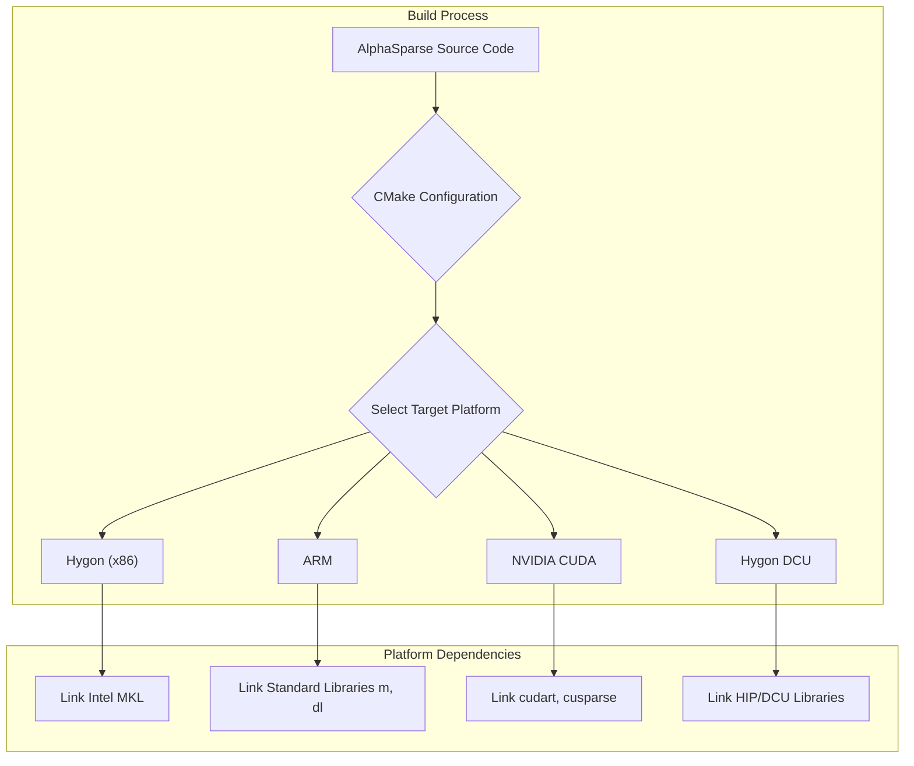
```mermaid
graph TD
  subgraph Build Process
    A[AlphaSparse Source Code] --> B{CMake Configuration}
    B --> C{Select Target Platform}
    C --> D["Hygon (x86)"]
    C --> E["ARM"]
    C --> F["NVIDIA CUDA"]
    C --> G["Hygon DCU"]
  end

  subgraph Platform Dependencies
    D --> D_LIB[Link Intel MKL]
    E --> E_LIB[Link Standard Libraries m, dl]
    F --> F_LIB[Link cudart, cusparse]
    G --> G_LIB[Link HIP/DCU Libraries]
  end

```

*Sources: hygon/test/CMakeLists.txt, arm/test/CMakeLists.txt, cuda/test/CMakeLists.txt, include/alphasparse/kernel_dcu/kernel_bsr_c_dcu.h*

### Hygon (x86)

For the Hygon x86 platform, the project heavily relies on the Intel Math Kernel Library (MKL) to optimize performance. The CMake configuration files explicitly specify linking to multiple MKL components.

```
# hygon/test/CMakeLists.txt:13-22target_link_libraries(${TEST_TARGET} PUBLIC    alphasparse
    # mkl_gnu_thread    # mkl_cdft_core    mkl_intel_lp64
    mkl_intel_thread
    mkl_core
    iomp5
    m
    dl
)
```

*Sources: hygon/test/CMakeLists.txt:13-22*

### ARM

The build configuration for the ARM platform is relatively simple. It does not depend on a specific commercial math library, but instead links to the standard math library (`m`) and the dynamic linking library (`dl`). This suggests that the ARM backend may contain a separate set of platform-optimized kernel implementations.

*Sources: arm/test/CMakeLists.txt:13-18*

### NVIDIA CUDA

To leverage the parallel computing capability of NVIDIA GPUs, the project integrates CUDA support. The test code is compiled as CUDA executables and linked to the `cudart` and `cusparse` libraries. The build system also allows specifying the target GPU architecture via the `CUDA_ARCH` variable, thereby enabling optimizations for specific hardware (such as the Ampere architecture that supports `bf16`).

```
# cuda/test/CMakeLists.txt:14-20target_link_libraries(${TEST_TARGET} PUBLIC    CUDA::cudart    CUDA::cudart_static    CUDA::cusparse    CUDA::cusparse_static    alphasparse
)
```

*Sources: cuda/test/CMakeLists.txt:14-20, 23-24*

### Hygon DCU

From the existence of functions with the `dcu_` prefix and the `hip/` directory, it can be inferred that the project also supports the Hygon DCU platform based on HIP (Heterogeneous-compute Interface for Portability). This enables the code to run on both AMD and Hygon GPUs, achieving code portability.

*Sources: include/alphasparse/kernel_dcu/kernel_bsr_c_dcu.h, hip/test/include/args.h*

## Supported Sparse Matrix Formats and Data Types

AlphaSparse provides support for a variety of common sparse matrix storage formats to accommodate different sparsity patterns and algorithm requirements.

### Matrix Formats

| Format | Header File Example | Description |
| --- | --- | --- |
| **CSR** (Compressed Sparse Row) | `kernel_csr_c.h` | Compressed row storage, suitable for row operations. |
| **CSC** (Compressed Sparse Column) | `kernel_csc_c.h` | Compressed column storage, suitable for column operations. |
| **COO** (Coordinate) | `kernel_coo_c.h` | Coordinate format, easy to construct. |
| **DIA** (Diagonal) | `kernel_dia_c.h` | Diagonal format, suitable for diagonally structured matrices. |
| **BSR** (Block Sparse Row) | `kernel_bsr_c.h` | Block compressed row storage, suitable for matrices with block-wise non-zero patterns. |
| **GEBSR** (General Block Sparse Row) | `kernel_gebsr_c.h` | General block sparse row format. |

*Sources: include/alphasparse/kernel_plain/kernel_csr_c.h, include/alphasparse/kernel_plain/kernel_csc_c.h, include/alphasparse/kernel_plain/kernel_coo_c.h, include/alphasparse/kernel_plain/kernel_dia_c.h, include/alphasparse/kernel_plain/kernel_bsr_c.h, include/alphasparse/kernel/kernel_gebsr_c.h*

### Data Types

The library supports data of multiple precisions and types to meet the requirements of different computing scenarios.

- **Single-precision complex**: `ALPHA_Complex8` (`c`)
- **Double-precision complex**: `ALPHA_Complex16` (`z`)
- **Single-precision floating-point**: `f32`
- **Double-precision floating-point**: `f64`
- **Half-precision floating-point**: `f16` (mainly used in CUDA)
- **Bfloat16**: `bf16` (mainly used in CUDA)
- **8-bit integer**: `i8` (mainly used in CUDA)

*Sources: include/alphasparse/kernel_plain/kernel_dia_c.h, include/alphasparse/kernel_plain/kernel_dia_z.h, cuda/test/CMakeLists.txt:25-44*

## Summary

AlphaSparse is a powerful and highly portable sparse linear algebra library. By supporting multiple hardware platforms, sparse matrix formats, and data types, it provides developers in the fields of scientific and engineering computing with a flexible and efficient tool. Its modular design and clear build process allow it to easily adapt to evolving hardware environments and provide optimized performance for specific computing tasks.

---

## Architecture Overview

### Related Pages

Related topics: [Project Introduction](about:blank#page-intro), [CUDA Backend Implementation](about:blank#page-backend-cuda), [HIP Backend Implementation](about:blank#page-backend-hip), [CPU Backend Implementation (ARM & Hygon)](about:blank#page-backend-cpu)

- Relevant source files
    
    The following files were used as context for generating this wiki page:
    
    - [hygon/test/CMakeLists.txt](hygon/test/CMakeLists.txt)
    - [arm/test/CMakeLists.txt](arm/test/CMakeLists.txt)
    - [cuda/test/CMakeLists.txt](cuda/test/CMakeLists.txt)
    - [hip/test/CMakeLists.txt](hip/test/CMakeLists.txt)
    - [cuda/test/include/args.h](cuda/test/include/args.h)
    - [hip/test/include/common.h](hip/test/include/common.h)
    - [include/alphasparse/kernel_dcu/kernel_csr_c_dcu.h](include/alphasparse/kernel_dcu/kernel_csr_c_dcu.h)
    - [cuda/kernel/level3/ac/MultiplyKernels.h](cuda/kernel/level3/ac/MultiplyKernels.h)

# Architecture Overview

The Alphasparse library is a multi-platform linear algebra library designed for high-performance sparse computing. Its core architecture aims to provide a unified API while leveraging platform-specific optimizations of different hardware platforms at the lower level. The library supports multiple hardware backends, including CPU (Hygon/x86-64, ARM) and GPU (NVIDIA CUDA, AMD HIP/DCU), and achieves modularity and extensibility of the code through a layered kernel design.

This architecture ensures cross-platform consistency and correctness through a common test framework that uses standardized command-line arguments to configure and execute tests. This design allows developers to focus on algorithm implementation while abstracting the complexity of platform adaptation into the underlying backend.

## Multi-Platform Backend Architecture

The core design philosophy of Alphasparse is "write once, run anywhere", dispatching through a common API to backend implementations optimized for specific hardware. This layered architecture decouples the user application from the underlying hardware implementation.

Sources: hygon/test/CMakeLists.txt, arm/test/CMakeLists.txt, cuda/test/CMakeLists.txt, hip/test/CMakeLists.txt

The following diagram illustrates this layered dispatch architecture:

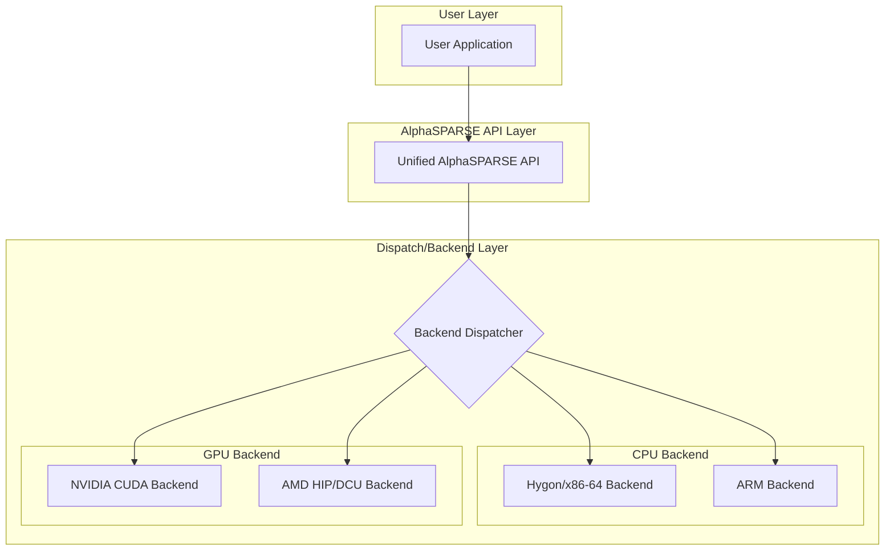
```mermaid
graph TD
    subgraph User Layer
        A[User Application]
    end

    subgraph AlphaSPARSE API Layer
        B[Unified AlphaSPARSE API]
    end

    subgraph Dispatch/Backend Layer
        C{Backend Dispatcher}

        subgraph CPU Backend
            D[Hygon/x86-64 Backend]
            E[ARM Backend]
        end

        subgraph GPU Backend
            F[NVIDIA CUDA Backend]
            G[AMD HIP/DCU Backend]
        end
    end

    A --> B
    B --> C
    C --> D
    C --> E
    C --> F
    C --> G
```

### CPU Backend

The CPU backend provides sparse computing capability for general-purpose computing platforms and is adapted for different CPU architectures.

**Hygon (x86-64)**

This backend targets the x86-64 architecture, especially Hygon processors. To maximize performance, it relies on the Intel Math Kernel Library (MKL). The build system configuration explicitly links the MKL-related libraries.

- `mkl_intel_lp64`
- `mkl_intel_thread`
- `mkl_core`
- `iomp5`

Sources: hygon/test/CMakeLists.txt:14-19

**ARM**

The ARM backend provides support for the ARM architecture. Unlike the Hygon backend, it does not depend on a specific commercial math library (such as MKL), but instead links standard system libraries, indicating that its implementation is more general-purpose.

Sources: arm/test/CMakeLists.txt:14-17

### GPU Backend

The GPU backend leverages parallel computing platforms and dedicated sparse computing libraries provided by mainstream GPU vendors to achieve high-performance acceleration.

**NVIDIA CUDA**

This backend is designed for NVIDIA GPUs and uses the CUDA platform. It links the CUDA runtime (`cudart`) and the cuSPARSE library (`cusparse`) to perform sparse computing tasks. The build configuration also defines the target CUDA architecture (`CUDA_ARCH`) and enables specific tests for the BF16 data type for architectures with compute capability 8.0 and above, demonstrating its support for new hardware features.

Sources: cuda/test/CMakeLists.txt:12-16, cuda/test/CMakeLists.txt:20-22

**AMD HIP/DCU**

This backend is designed for AMD GPUs and uses HIP (Heterogeneous-compute Interface for Portability) as the programming interface. It links the `roc::hipsparse` library. The `dcu` prefix that frequently appears in kernel function names (e.g., `dcu_hermv_c_csr_n_hi_trans`) indicates that these kernels are designed for AMD's data center GPUs (DCU).

Sources: hip/test/CMakeLists.txt:30-35, include/alphasparse/kernel_dcu/kernel_csr_c_dcu.h:4

## Unified Test Framework

To ensure functional correctness and consistent performance across all supported platforms, the project adopts a unified test framework. The test directory of each backend (`hygon`, `arm`, `cuda`, `hip`) contains a `CMakeLists.txt` file that defines a function named `add_alphasparse_example`, used to add and configure test executables in a standardized way.

Sources: hygon/test/CMakeLists.txt:1, cuda/test/CMakeLists.txt:1

### Command-Line Argument Parsing

The test program can be flexibly configured via command-line arguments, making it easy to perform tests and performance analysis for specific scenarios. The `args.h` header file defines the functions for parsing these parameters.

The following table summarizes some key command-line arguments and their effects:

| Parameter Category | Description | Default Value | Source |
| --- | --- | --- | --- |
| `layout` | Defines the layout of the dense matrix (row-major or column-major) | `ALPHA_SPARSE_LAYOUT_ROW_MAJOR` | `cuda/test/include/args.h:12` |
| `op` | Specifies the operation type of the sparse matrix (non-transpose, transpose, etc.) | `ALPHA_SPARSE_OPERATION_NON_TRANSPOSE` | `cuda/test/include/args.h:13` |
| `format` | Specifies the storage format of the sparse matrix | `ALPHA_SPARSE_FORMAT_CSR` | `cuda/test/include/args.h:15` |
| `data_type` | Specifies the data type of the matrix elements | `ALPHA_R_32F` | `cuda/test/include/args.h:16` |
| `iter` | Specifies the number of iterations for the test | `1` | `cuda/test/include/args.h:14` |
| `warmup` | Specifies the number of warm-up runs | `1` | `cuda/test/include/args.h:11` |
| `check` | Whether to perform result correctness checking | `false` | `cuda/test/include/args.h:9` |

Sources: cuda/test/include/args.h:8-40

### Backend Library Abstraction and Mapping

When interacting with or comparing against vendor-specific libraries (such as hipSPARSE), the test framework uses a layer of abstraction mapping. The `hip/test/include/common.h` file defines a series of `std::map`s that convert Alphasparse's internal enumeration types into the enumeration types of a specific backend. This abstraction simplifies the test code and makes it more readable and maintainable.

Sources: hip/test/include/common.h

The following diagram illustrates the mapping process from `alphasparseOperation_t` to `hipsparseOperation_t`:

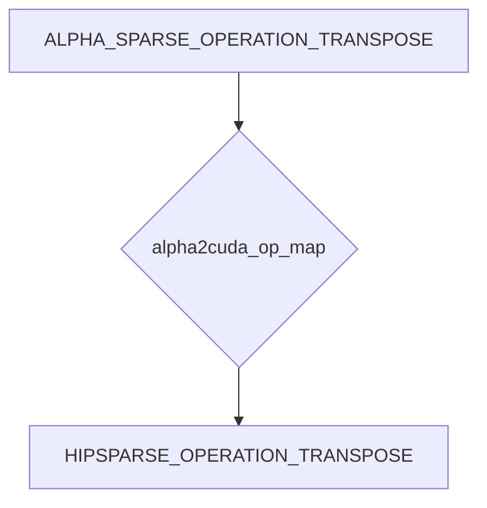
```mermaid
graph TD
    A[ALPHA_SPARSE_OPERATION_TRANSPOSE] --> B{alpha2cuda_op_map};
    B --> C[HIPSPARSE_OPERATION_TRANSPOSE];
```

The following table shows the mapping between some Alphasparse enumerations and hipSPARSE enumerations:

| Alphasparse Enum | hipSPARSE Enum |
| --- | --- |
| `ALPHA_SPARSE_OPERATION_NON_TRANSPOSE` | `HIPSPARSE_OPERATION_NON_TRANSPOSE` |
| `ALPHA_SPARSE_OPERATION_TRANSPOSE` | `HIPSPARSE_OPERATION_TRANSPOSE` |
| `ALPHA_SPARSE_OPERATION_CONJUGATE_TRANSPOSE` | `HIPSPARSE_OPERATION_CONJUGATE_TRANSPOSE` |
| `ALPHA_SPARSE_FILL_MODE_UPPER` | `HIPSPARSE_FILL_MODE_UPPER` |
| `ALPHA_SPARSE_DIAG_NON_UNIT` | `HIPSPARSE_DIAG_TYPE_NON_UNIT` |

Sources: hip/test/include/common.h:46-75

## Kernel Function Naming Convention

The kernel functions in the library follow a strict and informative naming convention, making their functionality clearly understandable from the function name alone. This convention improves the code's readability and maintainability.

The naming structure is typically: `[backend]_[function]_[type]_[format]_[options]`

The following table explains each part of the naming convention in detail:

| Part | Description | Example (`dcu_trmv_c_csr_n_lo_trans`) |
| --- | --- | --- |
| **Backend** | The hardware backend that executes the kernel. For example `dcu` (AMD), `plain` (generic CPU). | `dcu` |
| **Function** | The main operation performed by the function. For example `trmv` (triangular matrix-vector multiply), `gemm` (general matrix multiply). | `trmv` |
| **Type** | The data type of the matrix elements. `c` represents single-precision complex, `z` represents double-precision complex. | `c` |
| **Format** | The storage format of the sparse matrix. For example `csr`, `bsr`, `dia`. | `csr` |
| **Options** | Specific parameters of the operation. For example `n` (non-unit diagonal), `u` (unit diagonal), `lo` (lower triangular), `hi` (upper triangular), `trans` (transpose). | `n_lo_trans` |

Sources: include/alphasparse/kernel_dcu/kernel_csr_c_dcu.h:13, include/alphasparse/kernel_dcu/kernel_bsr_c_dcu.h:13

## Summary

The Alphasparse library adopts a highly modular and extensible cross-platform architecture. By combining a unified API with backend implementations optimized for specific hardware (x86, ARM, NVIDIA CUDA, AMD HIP), the library can deliver high-performance sparse linear algebra operations in different computing environments. Its unified test framework, clear kernel naming convention, and support for new hardware features together form a robust scientific computing foundation library that is easy to maintain and extend.

---

## Supported Sparse Matrix Formats

### Related Pages

Related topics: [Level 2 Functions (SpMV)](about:blank#page-api-level2), [Level 3 Functions (SpMM)](about:blank#page-api-level3)

- Relevant source files
    
    The following files were used as context for generating this wiki page:
    
    - `arm\kernel\level2\mv\trmv\trmv_bsr_u_hi_conj.hpp`
    - `arm\kernel\level2\mv\trmv\trmv_bsr_u_hi_trans.hpp`
    - `arm\test\CMakeLists.txt`
    - `arm\test\include\args.h`
    - `cuda\kernel\level3\ac\MultiplyKernels.h`
    - `cuda\test\CMakeLists.txt`
    - `cuda\test\include\args.h`
    - `dcu\test\include\args.h`
    - `hip\test\include\args.h`
    - `hygon\kernel\level2\mv\trmv\trmv_bsr_u_hi_conj.hpp`
    - `hygon\kernel\level2\mv\trmv\trmv_bsr_u_hi_trans.hpp`
    - `hygon\test\CMakeLists.txt`
    - `hygon\test\include\args.h`
    - `include\alphasparse\kernel\kernel_bsr_c.h`
    - `include\alphasparse\kernel\kernel_dia_c.h`
    - `include\alphasparse\kernel_plain\kernel_bsr_c.h`
    - `include\alphasparse\kernel_plain\kernel_csc_c.h`
    - `include\alphasparse\kernel_plain\kernel_csr_c.h`
    - `include\alphasparse\kernel_plain\kernel_csr_z.h`
    - `include\alphasparse\kernel_plain\kernel_dia_c.h`

# Supported Sparse Matrix Formats

The AlphaSparse library supports multiple sparse matrix storage formats to optimize the performance of differently structured sparse matrices. Choosing the appropriate format for a specific application is crucial for achieving efficient computation. The core functionality of the library revolves around specialized kernel implementations for these formats, covering operations from Level 2 matrix-vector operations to Level 3 matrix-matrix operations.

The default sparse matrix format is CSR (Compressed Sparse Row), which is explicitly defined in the test configuration files of various backends (such as CUDA, HIP, Hygon). However, the library also provides extensive support for formats such as CSC, BSR, DIA, COO, and BELL, especially in the CUDA backend, whose test suite demonstrates comprehensive coverage of multiple formats and data types.

Sources: `hip/test/include/args.h:17`, `cuda/test/include/args.h:17`, `hygon/test/include/args.h:17`, `dcu/test/include/args.h:17`, `arm/test/include/args.h:17`, `include/alphasparse/kernel_plain/kernel_csr_c.h`, `include/alphasparse/kernel_plain/kernel_csc_c.h`, `include/alphasparse/kernel_plain/kernel_bsr_c.h`, `cuda/test/CMakeLists.txt`

## Format Overview

The following table summarizes the main sparse matrix formats supported in the AlphaSparse library.

| Format | Full Name | Description | Main Use Case |
| --- | --- | --- | --- |
| **CSR** | Compressed Sparse Row | Compresses and stores non-zero elements row by row. This is the library's default format. | General sparse matrices, especially when row operations are frequent. |
| **CSC** | Compressed Sparse Column | Compresses and stores non-zero elements column by column. | When column operations are frequent, e.g., in operations of the type `A^T * x`. |
| **BSR** | Block Sparse Row | Divides the matrix into fixed-size blocks and stores the non-zero blocks. | Sparse matrices with dense sub-block patterns. |
| **DIA** | Diagonal | Stores only the non-zero elements on the main diagonal and sub-diagonals. | Diagonal matrices or banded matrices. |
| **COO** | Coordinate | Stores the row index, column index, and value of each non-zero element. | Convenient when constructing sparse matrices; usually converted to CSR or CSC for improved computational efficiency. |
| **BELL** | Bellpack | A variant of BSR optimized for SIMD/SIMT architectures. | Suitable for specific hardware architectures to optimize memory access patterns. |

Sources: `cuda/test/CMakeLists.txt`, `hygon/test/CMakeLists.txt`, `include/alphasparse/kernel_plain/kernel_csr_c.h`, `include/alphasparse/kernel_plain/kernel_csc_c.h`, `include/alphasparse/kernel_plain/kernel_bsr_c.h`, `include/alphasparse/kernel_plain/kernel_dia_c.h`

### Format Parsing and Configuration

In the test framework, the sparse matrix format to be used can be specified via command-line arguments. The `alphasparse_format_parse` function is responsible for parsing the string argument (e.g., "csr") into the internal `alphasparseFormat_t` enumeration value.

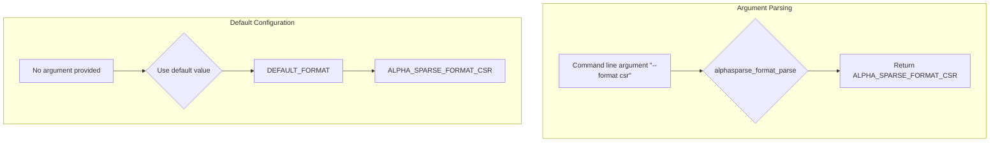
```mermaid
graph TD
    subgraph Argument Parsing
        A["Command line argument &quot;--format csr&quot;"] --> B{"alphasparse_format_parse"}
        B --> C["Return ALPHA_SPARSE_FORMAT_CSR"]
    end

    subgraph Default Configuration
        D["No argument provided"] --> E{"Use default value"}
        E --> F["DEFAULT_FORMAT"]
        F --> G["ALPHA_SPARSE_FORMAT_CSR"]
    end

```

**Figure 1**: The parsing flow of sparse formats in the command line.

The `args.h` header file defines the default format for different backends.

```c
// File: cuda/test/include/args.h:17-18#define DEFAULT_FORMAT ALPHA_SPARSE_FORMAT_CSR#define DEFAULT_DATA_TYPE ALPHA_R_32F
```

Sources: `cuda/test/include/args.h:17,27`, `hip/test/include/args.h:17,26`, `hygon/test/include/args.h:17,26`

## Detailed Explanation of Main Formats

### CSR (Compressed Sparse Row)

CSR is the preferred format in AlphaSparse. It uses three arrays to represent the sparse matrix:
1. `values`: Stores the values of the non-zero elements.
2. `col_indices`: Stores the column index corresponding to each non-zero element.
3. `row_ptr`: An array of length `(number of rows + 1)`, where `row_ptr[i]` indicates the starting position of the first non-zero element of row `i` in the `values` and `col_indices` arrays.

The library provides a large number of kernel functions for the CSR format, covering multiple data types such as single-precision complex (`c`) and double-precision complex (`z`).

```c
// File: include/alphasparse/kernel_plain/kernel_csr_c.h:11// alpha*A*x + beta*yalphasparseStatus_t gemv_c_csr_plain(const ALPHA_Complex8 alpha, const spmat_csr_c_t *A, const ALPHA_Complex8 *x, const ALPHA_Complex8 beta, ALPHA_Complex8 *y);
```

This format is widely used in the test files of various platforms, for example `spmm_csr_d_hygon_test.cpp` and `spmv_csr_r_f32_test.cu`.

Sources: `include/alphasparse/kernel_plain/kernel_csr_c.h:11`, `include/alphasparse/kernel_plain/kernel_csr_z.h:11`, `hygon/test/CMakeLists.txt:28`, `cuda/test/CMakeLists.txt:94`

### CSC (Compressed Sparse Column)

The CSC format is similar to CSR but compresses by column. It is very useful for operations that require efficient column access. The library also provides comprehensive kernel support for the CSC format.

```c
// File: include/alphasparse/kernel_plain/kernel_csc_c.h:11// alpha*A*x + beta*yalphasparseStatus_t gemv_c_csc_plain(const ALPHA_Complex8 alpha, const spmat_csc_c_t *A, const ALPHA_Complex8 *x, const ALPHA_Complex8 beta, ALPHA_Complex8 *y);
```

The test suites for the Hygon and ARM platforms include several CSC-format test cases, such as `spmm_csc_s_hygon_test.cpp`.

Sources: `include/alphasparse/kernel_plain/kernel_csc_c.h:11`, `hygon/test/CMakeLists.txt:31`, `arm/test/CMakeLists.txt:31`

### BSR (Block Sparse Row)

The BSR format is suitable for sparse matrices where non-zero elements cluster into dense blocks. It reduces indexing overhead and increases computational intensity by storing non-zero blocks rather than individual elements.

The kernel implementations (such as `trmv_bsr_u_hi_conj`) handle block-structured data and support both row-major (`ALPHA_SPARSE_LAYOUT_ROW_MAJOR`) and column-major (`ALPHA_SPARSE_LAYOUT_COLUMN_MAJOR`) block layouts.

```cpp
// File: hygon/kernel/level2/mv/trmv/trmv_bsr_u_hi_conj.hpp:19    if (A->block_layout == ALPHA_SPARSE_LAYOUT_ROW_MAJOR){        // ...    }else if (A->block_layout == ALPHA_SPARSE_LAYOUT_COLUMN_MAJOR){        // ...    }
```

The `kernel_bsr_c.h` header file defines various operations for the BSR format, including general matrix-vector multiplication (`gemv`), symmetric matrix-vector multiplication (`symv`), and Hermitian matrix-vector multiplication (`hermv`).

Sources: `include/alphasparse/kernel/kernel_bsr_c.h:11-45`, `include/alphasparse/kernel_plain/kernel_bsr_c.h:8-42`, `hygon/kernel/level2/mv/trmv/trmv_bsr_u_hi_conj.hpp:19-74`, `arm/kernel/level2/mv/trmv/trmv_bsr_u_hi_conj.hpp:19-74`

### DIA (Diagonal)

The DIA format is designed for diagonal matrices and banded matrices. It stores a two-dimensional array, where each row corresponds to a non-zero diagonal, along with an offset array indicating the position of each diagonal relative to the main diagonal. The kernel functions for this format are defined in `kernel_dia_c.h`.

*Sources: `include/alphasparse/kernel/kernel_dia_c.h`, `include/alphasparse/kernel_plain/kernel_dia_c.h`*

### COO and BELL (CUDA only)

The CUDA backend also supports the COO and BELL formats.
- **COO (Coordinate)** format is popular in many applications due to its simple construction. The CUDA test suite contains a large number of COO tests, such as `spmv_coo_r_f32_test.cu` and `spmm_coo_r_f32_test.cu`.
- **BELL (Bellpack)** format is a variant of BSR designed to optimize memory access on specific hardware. The CUDA tests also include test cases such as `spmm_bell_c_f32_test.cu`.

Support for these two formats shows that AlphaSparse is committed to providing hardware-specific optimized solutions on high-performance computing platforms.

Sources: `cuda/test/CMakeLists.txt:89, 201, 218`

## Summary

The AlphaSparse library provides flexible and high-performance solutions for different types of sparse computing problems by supporting multiple sparse matrix formats. With CSR as the default format, while providing strong support for CSC, BSR, DIA, etc., and extending to specialized formats such as COO and BELL on high-performance backends like CUDA, the library can meet the needs from general-purpose computing to highly optimized applications. Developers can choose the most suitable format based on the specific structure and computing requirements of their matrices to maximize performance.

---

## Build Guide

### Related Pages

Related topics: [Testing Guide](about:blank#page-testing-guide)

- Relevant source files
    
    The following files were used as context for generating this wiki page:
    
    - [hygon/test/CMakeLists.txt](hygon/test/CMakeLists.txt)
    - [arm/test/CMakeLists.txt](arm/test/CMakeLists.txt)
    - [cuda/test/CMakeLists.txt](cuda/test/CMakeLists.txt)
    - [cuda/kernel/level3/ac/MultiplyKernels.h](cuda/kernel/level3/ac/MultiplyKernels.h)
    - [include/alphasparse/kernel_plain/kernel_csr_c.h](include/alphasparse/kernel_plain/kernel_csr_c.h)

# Build Guide

This document provides detailed technical instructions on the build system of the AlphaSparse library test suite. The project uses CMake for build management and provides customized build configurations for different target hardware platforms (including Hygon, ARM, and CUDA). The core of the build script is a helper function that handles dependencies and compilation options according to the target platform, thereby simplifying the creation of test executables.

## Core Build Function: `add_alphasparse_example`

All platform-specific `CMakeLists.txt` files define and use a CMake function named `add_alphasparse_example`. This function encapsulates the common logic required to create an executable target for a single test source file.

The following flowchart shows the main execution steps of this function:

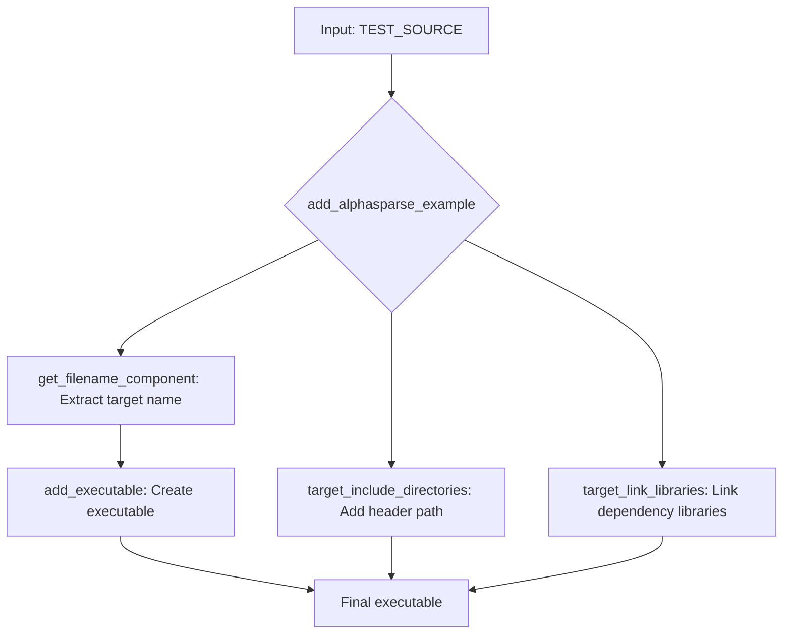
```mermaid
graph TD
    A[Input: TEST_SOURCE] --> B{add_alphasparse_example};
    B --> C[get_filename_component: Extract target name];
    C --> D[add_executable: Create executable];
    B --> E[target_include_directories: Add header path];
    B --> F[target_link_libraries: Link dependency libraries];
    D --> G[Final executable];
    E --> G;
    F --> G;
```

*Figure 1: The general workflow of the `add_alphasparse_example` function*
Sources: hygon/test/CMakeLists.txt:1-24, arm/test/CMakeLists.txt:1-20, cuda/test/CMakeLists.txt:1-20

The main responsibilities of this function include:
1. **Target naming**: Extract the base name from the source file name as the executable target name.
2. **Create executable**: Use the `add_executable` command to create the target from the given source file.
3. **Include directories**: Add the project's top-level `include` directory to the target's include path.
4. **Link libraries**: Link the core `alphasparse` library and platform-specific dependencies to the target.

The specific implementation details of each platform differ, especially in terms of linked libraries and compilation definitions.

## Platform-Specific Build Configuration

The build system provides different configurations for three main platforms: Hygon (x86_64), ARM, and CUDA.

### Hygon Platform

The build configuration for the Hygon platform focuses on leveraging the Intel Math Kernel Library (MKL) for performance optimization.

**Linker Dependencies**

In addition to the core `alphasparse` library, Hygon targets also link the following MKL and system libraries:

| Library Name | Description |
| --- | --- |
| `alphasparse` | Core AlphaSparse library |
| `mkl_intel_lp64` | MKL LP64 interface layer |
| `mkl_intel_thread` | MKL threading layer |
| `mkl_core` | MKL core computation library |
| `iomp5` | Intel OpenMP runtime library |
| `m` | Standard math library |
| `dl` | Dynamic linking library |

Sources: hygon/test/CMakeLists.txt:13-21

**Built Test Targets**

This platform builds test cases for multiple Level 2 and Level 3 features, for example:
- `mv_hygon_test`
- `sv_hygon_test`
- `mm_hygon_test`
- `spmm_csr_d_hygon_test`
- `trsm_hygon_test`

Sources: hygon/test/CMakeLists.txt:26-43

### ARM Platform

The build configuration for the ARM platform is relatively simple, mainly relying on standard system libraries.

**Linker Dependencies**

The libraries linked by ARM targets are as follows:

| Library Name | Description |
| --- | --- |
| `alphasparse` | Core AlphaSparse library |
| `m` | Standard math library |
| `dl` | Dynamic linking library |

Sources: arm/test/CMakeLists.txt:13-17

**Built Test Targets**

The test targets built on the ARM platform are similar to those on the Hygon platform, covering various sparse computing features of Level 2 and Level 3.
- `mv_hygon_test`
- `sv_csr_s_hygon_test`
- `mm_hygon_test`
- `spmm_csc_s_hygon_test`
- `trsm_csr_s_hygon_test`

Sources: arm/test/CMakeLists.txt:22-40

### CUDA Platform

The build configuration for the CUDA platform is the most complex, handling specific GPU architectures, compilation definitions, and CUDA runtime libraries.

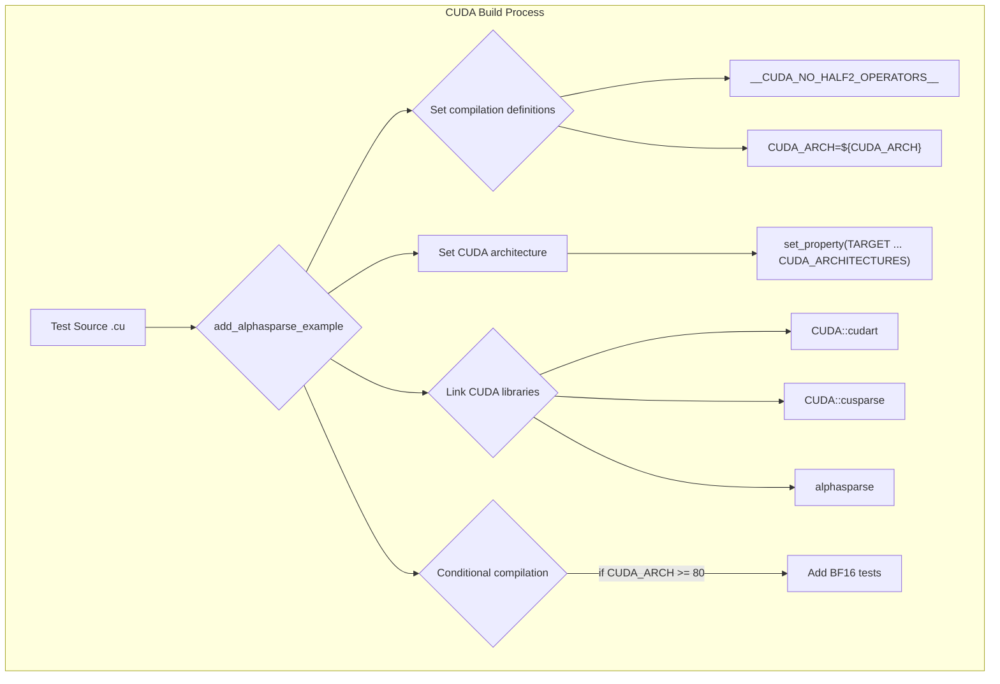
```mermaid
graph TD
    subgraph CUDA Build Process
        A[Test Source .cu] --> B{add_alphasparse_example};
        B --> C{Set compilation definitions};
        C --> D["__CUDA_NO_HALF2_OPERATORS__"];
        C --> E["CUDA_ARCH=${CUDA_ARCH}"];
        B --> F[Set CUDA architecture];
        F --> G["set_property(TARGET ... CUDA_ARCHITECTURES)"];
        B --> H{Link CUDA libraries};
        H --> I[CUDA::cudart];
        H --> J[CUDA::cusparse];
        H --> K[alphasparse];
        B --> L{Conditional compilation};
        L -- "if CUDA_ARCH >= 80" --> M[Add BF16 tests];
    end
```

*Figure 2: CUDA platform build flow*
Sources: cuda/test/CMakeLists.txt:1-40

**Key Configuration**

- **Compilation definitions**:
    - `__CUDA_NO_HALF2_OPERATORS__`: Disables operator overloading for the half2 type.
    - `CUDA_ARCH`: Passes the GPU compute capability architecture version to the compiler.
    Sources: cuda/test/CMakeLists.txt:4-5
- **CUDA architecture**: Use the `set_property` command to explicitly set the `CUDA_ARCHITECTURES` property for the target, ensuring code is generated for the correct GPU architecture.
Sources: cuda/test/CMakeLists.txt:6
- **Linker dependencies**:
    - `CUDA::cudart` / `CUDA::cudart_static`: CUDA runtime library.
    - `CUDA::cusparse` / `CUDA::cusparse_static`: NVIDIA cuSPARSE library.
    - `alphasparse`: Core AlphaSparse library.
    Sources: cuda/test/CMakeLists.txt:13-18
- **Conditional compilation**: The build script checks the `CUDA_ARCH` variable. If the compute capability is greater than or equal to 8.0 (e.g., the NVIDIA Ampere architecture), it additionally compiles test cases that support the `bfloat16` data type.
Sources: cuda/test/CMakeLists.txt:23-40

**Built Test Targets**

The CUDA platform builds a large number of test cases, covering multiple categories such as generic, Level 2, Level 3, preconditioners, and reordering. Some examples are as follows:
- `generic/axpby_r_f32_test`
- `level2/spmv_csr_r_f32_test`
- `level3/spgemm_csr_r_f32_test`
- `precond/csric02_r32_test`
- `reordering/csrcolor_r32_test`

Sources: cuda/test/CMakeLists.txt:42-300

---

## Level 2 Functions (SpMV)

### Related Pages

Related topics: [Level 3 Functions (SpMM)](about:blank#page-api-level3), [Supported Sparse Matrix Formats](about:blank#page-matrix-formats)

- Relevant source files
    
    The following files were used as context for generating this wiki page:
    
    - [include/alphasparse/kernel_plain/kernel_csr_c.h](include/alphasparse/kernel_plain/kernel_csr_c.h)
    - [include/alphasparse/kernel_plain/kernel_bsr_c.h](include/alphasparse/kernel_plain/kernel_bsr_c.h)
    - [include/alphasparse/kernel_plain/kernel_csc_c.h](include/alphasparse/kernel_plain/kernel_csc_c.h)
    - [include/alphasparse/kernel_plain/kernel_dia_c.h](include/alphasparse/kernel_plain/kernel_dia_c.h)
    - [include/alphasparse/kernel/kernel_bsr_c.h](include/alphasparse/kernel/kernel_bsr_c.h)
    - [include/alphasparse/kernel/kernel_dia_c.h](include/alphasparse/kernel/kernel_dia_c.h)
    - [include/alphasparse/kernel/kernel_sky_c.h](include/alphasparse/kernel/kernel_sky_c.h)
    - [cuda/test/CMakeLists.txt](cuda/test/CMakeLists.txt)
    - [hip/test/include/args.h](hip/test/include/args.h)
    - [hygon/test/CMakeLists.txt](hygon/test/CMakeLists.txt)
    - [arm/test/CMakeLists.txt](arm/test/CMakeLists.txt)

# Level 2 Functions (SpMV)

Level 2 functions form the core of operations between sparse matrices and dense vectors in the AlphaSPARSE library. These functions mainly implement sparse matrix-vector multiplication (Sparse Matrix-Vector Multiplication, SpMV) and its variants, such as symmetric matrix-vector multiplication and triangular solve. This module aims to provide a unified interface for multiple hardware backends (including CPU, CUDA, and HIP), while supporting multiple sparse matrix storage formats and data types.

The design of these functions follows the naming conventions of BLAS (Basic Linear Algebra Subprograms), providing a rich set of operations for general, symmetric, Hermitian, and triangular matrices. Through detailed function naming, users can precisely control various aspects of the operation, such as transpose operations, fill mode, and diagonal type. The structure of the test suite also reflects this multi-platform, multi-format support, providing dedicated test cases for each backend and feature combination.

## API Overview

The API of Level 2 functions is organized around several core SpMV operations. These operations are distinguished by prefixes in the function name and support multiple parameters to control specific behavior.

Sources: include/alphasparse/kernel_plain/kernel_csr_c.h, include/alphasparse/kernel_plain/kernel_bsr_c.h

### Main Function Categories

| Function Category | Description | Example Formula |
| --- | --- | --- |
| `gemv` | General sparse matrix-vector multiplication | `y = alpha * op(A) * x + beta * y` |
| `symv` | Symmetric sparse matrix-vector multiplication | `y = alpha * A * x + beta * y` |
| `hermv` | Hermitian sparse matrix-vector multiplication | `y = alpha * A * x + beta * y` |
| `trsv` | Triangular sparse system solve | `op(A) * x = alpha * y` |
| `spsv` | Sparse system solve for sparse vectors | `op(A) * x = alpha * y` |

### Function Naming Convention

The naming of AlphaSPARSE Level 2 functions follows a systematic pattern to clearly convey their functionality.

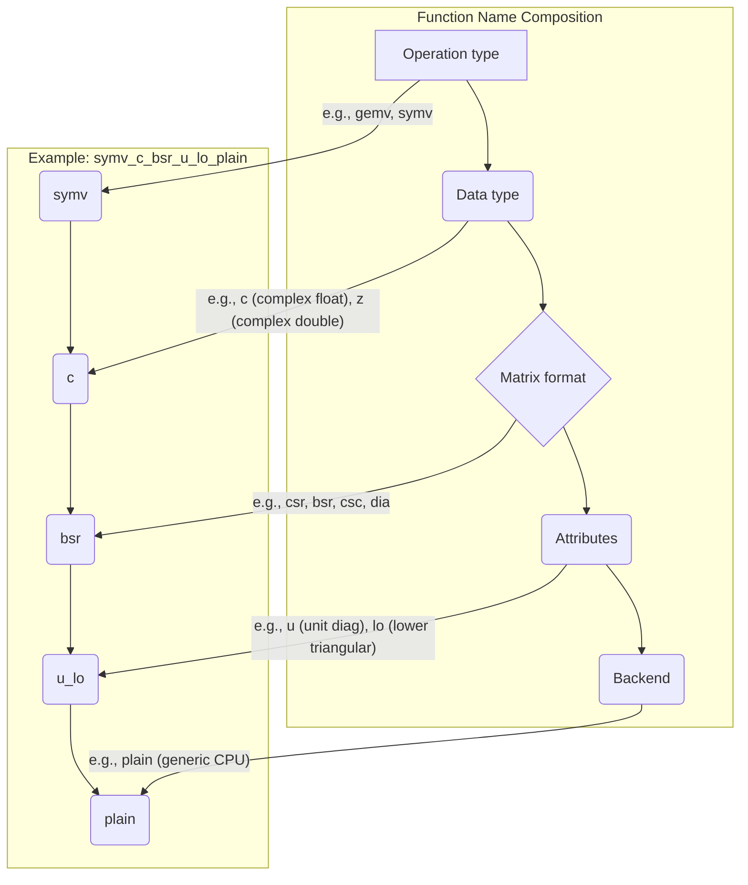
```mermaid
graph TD
    subgraph Function Name Composition
        A[Operation type] --> B(Data type)
        B --> C{Matrix format}
        C --> D(Attributes)
        D --> E(Backend)
    end

    subgraph Example: symv_c_bsr_u_lo_plain
        F(symv) --> G(c)
        G --> H(bsr)
        H --> I("u_lo")
        I --> J(plain)
    end

    A -- "e.g., gemv, symv" --> F
    B -- "e.g., c (complex float), z (complex double)" --> G
    C -- "e.g., csr, bsr, csc, dia" --> H
    D -- "e.g., u (unit diag), lo (lower triangular)" --> I
    E -- "e.g., plain (generic CPU)" --> J
```

This diagram shows how the function `symv_c_bsr_u_lo_plain` is composed of parts such as operation (symmetric vector multiply), data type (complex), format (BSR), attributes (unit diagonal, lower triangular), and backend (plain).

Sources: include/alphasparse/kernel_plain/kernel_bsr_c.h:20, include/alphasparse/kernel_plain/kernel_csr_c.h:22

## Supported Parameters and Data Structures

To perform SpMV operations, the API relies on several key enumerations and structures to define the matrix's attributes and operation types.

### Operation Type

The `alphasparseOperation_t` enumeration is used to specify whether the matrix should be transposed or conjugate-transposed.

| Enumeration Value | Description |
| --- | --- |
| `ALPHA_SPARSE_OPERATION_NON_TRANSPOSE` | Use the original matrix A |
| `ALPHA_SPARSE_OPERATION_TRANSPOSE` | Use the transpose AT of A |
| `ALPHA_SPARSE_OPERATION_CONJUGATE_TRANSPOSE` | Use the conjugate transpose AH of A |

Sources: hip/test/include/args.h:20

### Matrix Descriptor

The attributes of a matrix, such as symmetry, triangularity, and diagonal type, are defined through the `alpha_matrix_descr` structure. The test framework provides helper functions to parse these attributes from command-line arguments.

- **Matrix Type**: `alphasparse_matrix_type_t` (e.g., `ALPHA_SPARSE_MATRIX_TYPE_GENERAL`, `ALPHA_SPARSE_MATRIX_TYPE_SYMMETRIC`)
- **Fill Mode**: `alphasparse_fill_mode_t` (e.g., `ALPHA_SPARSE_FILL_MODE_LOWER`, `ALPHA_SPARSE_FILL_MODE_UPPER`)
- **Diag Type**: `alphasparse_diag_type_t` (e.g., `ALPHA_SPARSE_DIAG_TYPE_UNIT`, `ALPHA_SPARSE_DIAG_TYPE_NON_UNIT`)

Sources: hip/test/include/args.h:23-25, hip/test/include/args.h:60

## Backend Implementation and Testing

The AlphaSPARSE library provides dedicated backend implementations for different hardware platforms. Each backend has its own independent test suite to ensure correctness and performance on the target platform.

### Platform Support

As can be seen from the `CMakeLists.txt` files, the project builds tests for multiple platforms:
- **Hygon (x86)**: Links the Intel MKL library for optimized kernels.
- **ARM**: Builds for the ARM architecture.
- **CUDA**: Targets NVIDIA GPUs, links `cudart` and `cusparse`.
- **HIP**: Targets AMD GPUs.
- **DCU**: Targets Hygon DCU.

Sources: hygon/test/CMakeLists.txt:14-22, arm/test/CMakeLists.txt:13-17, cuda/test/CMakeLists.txt:14-19

### Test Framework

Test cases are added via a CMake function named `add_alphasparse_example`. This allows easily creating executables for each combination of Level 2 feature, data type, and matrix format.

For example, in `cuda/test/CMakeLists.txt`, we can see multiple tests added for CSR-format SpMV of different precisions:

```
# cuda/test/CMakeLists.txt:100-103add_alphasparse_example(level2/spmv_csr_r_f32_test.cu)
add_alphasparse_example(level2/spmv_csr_r_f64_test.cu)
add_alphasparse_example(level2/spmv_csr_c_f32_test.cu)
add_alphasparse_example(level2/spmv_csr_c_f64_test.cu)
```

The executables for these tests accept command-line arguments to specify the input matrix, number of iterations, and whether to perform validation; these parameters are parsed by functions in the `args.h` header file.

Sources: cuda/test/CMakeLists.txt:1, cuda/test/CMakeLists.txt:100-103, hip/test/include/args.h

### Test Execution Flow

The following sequence diagram illustrates the flow of running a typical SpMV test.

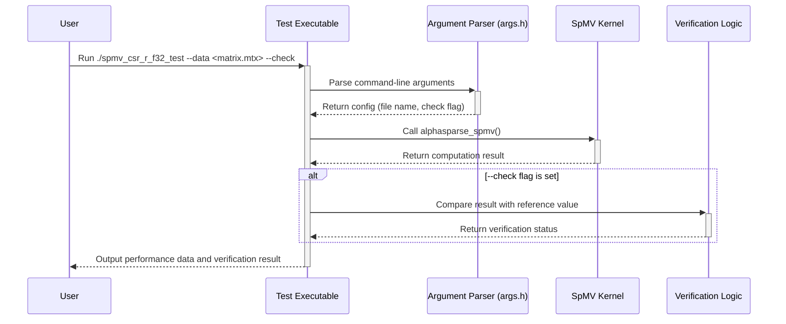
```mermaid
sequenceDiagram
    participant User as User
    participant TestBinary as Test Executable
    participant ArgParser as Argument Parser (args.h)
    participant SpMV_Kernel as SpMV Kernel
    participant Verification as Verification Logic

    User->>+TestBinary: Run ./spmv_csr_r_f32_test --data <matrix.mtx> --check
    TestBinary->>+ArgParser: Parse command-line arguments
    ArgParser-->>-TestBinary: Return config (file name, check flag)
    TestBinary->>+SpMV_Kernel: Call alphasparse_spmv()
    SpMV_Kernel-->>-TestBinary: Return computation result
    alt --check flag is set
        TestBinary->>+Verification: Compare result with reference value
        Verification-->>-TestBinary: Return verification status
    end
    TestBinary-->>-User: Output performance data and verification result
```

This flow shows how the user interacts with the test program via the command line, how the program parses parameters, calls the core SpMV kernel, and performs result verification as needed.

Sources: hip/test/include/args.h:31, cuda/test/CMakeLists.txt:301-304

## Summary

The AlphaSPARSE Level 2 functions provide a powerful and flexible interface for sparse matrix-vector operations. Through its modular design, it can support multiple hardware backends, sparse matrix formats, and numeric types. The clear API and naming conventions, combined with a comprehensive test framework, ensure the library's reliability and portability across different platforms. These Level 2 functions form the foundation for building more advanced sparse computing algorithms (such as iterative solvers).

---

## Level 3 Functions (SpMM)

### Related Pages

Related topics: [Level 2 Functions (SpMV)](about:blank#page-api-level2)

- Relevant source files
    
    The following files were used as context for generating this wiki page:
    
    - [cuda/kernel/level3/csrspgemm_device_ac.h](cuda/kernel/level3/csrspgemm_device_ac.h)
    - [cuda/kernel/level3/ac/MultiplyKernels.h](cuda/kernel/level3/ac/MultiplyKernels.h)
    - [cuda/test/CMakeLists.txt](cuda/test/CMakeLists.txt)
    - [hygon/test/CMakeLists.txt](hygon/test/CMakeLists.txt)
    - [arm/test/CMakeLists.txt](arm/test/CMakeLists.txt)
    - [cuda/test/include/args.h](cuda/test/include/args.h)
    - [include/alphasparse/kernel_plain/kernel_csr_c.h](include/alphasparse/kernel_plain/kernel_csr_c.h)

# Level 3 Functions (SpMM)

Level 3 functions in the AlphaSparse library mainly revolve around the multiplication of sparse matrices with sparse or dense matrices (SpMM). These functions are key components in high-performance computing, especially in the fields of scientific computing and machine learning. The library provides highly optimized implementations of SpMM for multiple hardware architectures including CUDA, Hygon (x86), and ARM.

This document mainly outlines the architecture of the SpMM functionality, especially its `ac-SpGEMM` implementation on the CUDA platform, the cross-platform testing strategy, and the related API definitions.

## CUDA Architecture (ac-SpGEMM)

The AlphaSparse library contains an advanced sparse matrix-sparse matrix multiplication (SpGEMM) implementation for NVIDIA GPUs, called `ac-SpGEMM`. This implementation uses a multi-stage approach to efficiently compute the product of two sparse matrices and can handle matrices of various sizes.

Sources: cuda/kernel/level3/csrspgemm_device_ac.h, cuda/kernel/level3/ac/MultiplyKernels.h

### Execution Flow

The execution flow of `ac-SpGEMM` is mainly divided into two stages: Compute and Merge. The compute stage processes the rows of the input matrix in parallel, generating intermediate results called "chunks". If multiple thread blocks process the same output row, the merge stage is required to merge these intermediate results into the final row.

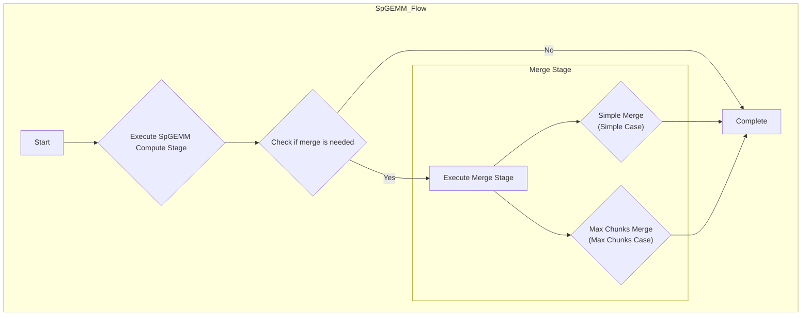
```mermaid
graph TD
    subgraph SpGEMM_Flow
        A["Start"] --> B{"Execute SpGEMM Compute Stage"}
        B --> C{"Check if merge is needed"}
        C -->|Yes| D["Execute Merge Stage"]
        C -->|No| F["Complete"]

        subgraph Merge Stage
            D --> D1{"Simple Merge\n(Simple Case)"}
            D --> D2{"Max Chunks Merge\n(Max Chunks Case)"}
        end

        D1 --> F
        D2 --> F
    end

```

**Flow Description:**
1. **SpGEMM Compute Stage**: The kernel `h_computeSpgemmPart` is called to compute partial products in parallel. Each thread block processes a portion of the rows of input matrix `A` and stores the results in a temporary chunk buffer.
2. **Merge Stage**:
* **Simple Merge (Simple Case)**: If all intermediate chunks of an output row can be fully loaded into shared memory, the `h_mergeSharedRowsSimple` kernel is called for merging.
* **Max Chunks Merge (Max Chunks Case)**: If the number of intermediate chunks exceeds the capacity of shared memory, the `h_mergeSharedRowsMaxChunks` kernel is called, using a more complex path-merge strategy to handle it.

Sources: cuda/kernel/level3/csrspgemm_device_ac.h:80-192

### Core Kernels

The functionality of `ac-SpGEMM` is provided by a set of CUDA kernel templates in the `AcSpGEMMKernels` class. These kernels are responsible for different stages of SpGEMM.

| Kernel Function | Description |
| --- | --- |
| `h_DetermineBlockStarts` | Determines the starting position of the non-zero elements (NNZ) that each thread block begins processing. |
| `h_computeSpgemmPart` | The main compute stage of SpGEMM. Computes partial products and stores the results in chunks. |
| `h_mergeSharedRowsSimple` | The kernel for the merge stage, used to handle simple cases that can fit into shared memory. |
| `h_mergeSharedRowsMaxChunks` | The kernel for the merge stage, used to handle complex cases requiring multi-path merging (number of chunks exceeds a threshold). |

Sources: cuda/kernel/level3/ac/MultiplyKernels.h:56-104

### Optimization and Template Parameters

The `ac-SpGEMM` implementation leverages C++ templates to achieve a high degree of compile-time configuration and optimization. Kernel calls select different execution paths based on the dimensions and characteristics of the input matrices.

A key optimization is the `SORT_TYPE_MODE` template parameter, which in the `h_computeSpgemmPart` kernel is used to select different data processing strategies based on the size of the matrix column indices:
* **Case 0 (`SORT_TYPE_MODE = 0`)**: Used when both row and column indices can be represented with 16 bits (`Arows < 0x10000 && Bcols < 0x10000`) for best performance.
* **Case 1 (`SORT_TYPE_MODE = 1`)**: When matrix B has few columns, remap local rows to reduce bit usage.
* **Case 2 (`SORT_TYPE_MODE = 2`)**: General case, no special optimization.

```cpp
// cuda/kernel/level3/csrspgemm_device_ac.h:83-128if (Arows < 0x10000 && Bcols < 0x10000){    // ...    spgemm.h_computeSpgemmPart<..., 0>(...);    // ...}else if (Bcols < (1 << LZCNT(nnz_per_thread*threads)) - 1){    // ...    spgemm.h_computeSpgemmPart<..., 1>(...);    // ...}else{    // ...    spgemm.h_computeSpgemmPart<..., 2>(...);    // ...}
```

Sources: cuda/kernel/level3/csrspgemm_device_ac.h:83-128

The main template parameters include:
| Parameter | Description |
| :— | :— |
| `NNZ_PER_THREAD` | Number of non-zero elements processed per thread. |
| `THREADS` | Number of threads per CUDA thread block. |
| `BLOCKS_PER_MP` | Number of thread blocks scheduled per streaming multiprocessor (SM). |
| `VALUE_TYPE` | Type of matrix values (e.g., float, double). |
| `INDEX_TYPE` | Type of matrix indices (e.g., int32_t). |
| `SORT_TYPE_MODE` | The optimization mode described above. |

Sources: cuda/kernel/level3/ac/MultiplyKernels.h:69-75, cuda/kernel/level3/csrspgemm_device_ac.h:86-88

## Cross-Platform Support and Testing

The AlphaSparse library ensures the correctness and performance of the SpMM functionality by providing independent test suites on different platforms (CUDA, Hygon, ARM). These tests are built and managed using CMake.

Sources: cuda/test/CMakeLists.txt, hygon/test/CMakeLists.txt, arm/test/CMakeLists.txt

### Test Case Compilation

Each platform has a `CMakeLists.txt` file that defines a function named `add_alphasparse_example` to simplify the creation of test executables.

The following is an example of the definition and usage of this function in the Hygon platform's `CMakeLists.txt`:

```
# hygon/test/CMakeLists.txt:1-19function(add_alphasparse_example TEST_SOURCE)
  get_filename_component(TEST_TARGET ${TEST_SOURCE} NAME_WE)
  include_directories(./include)
  add_executable(${TEST_TARGET} ${TEST_SOURCE})
  # ...  target_link_libraries(${TEST_TARGET} PUBLIC      alphasparse
      mkl_intel_lp64
      mkl_intel_thread
      mkl_core
      iomp5
      m
      dl
      )
endfunction()
add_alphasparse_example(level3/mm_hygon_test.cpp)
add_alphasparse_example(level3/spmm_hygon_test.cpp)
add_alphasparse_example(level3/spmm_csr_d_hygon_test.cpp)
```

This function automatically handles target naming, include directories, and library linking. By calling this function, new SpMM tests can be easily added, such as `spmm_hygon_test.cpp` and `spmm_csr_d_hygon_test.cpp`.

Sources: hygon/test/CMakeLists.txt:1-22, arm/test/CMakeLists.txt:1-17, cuda/test/CMakeLists.txt:1-16

### Linked Library Dependencies

The SpMM implementations on different platforms depend on different underlying libraries. The CMake build system handles these platform-specific linking requirements.

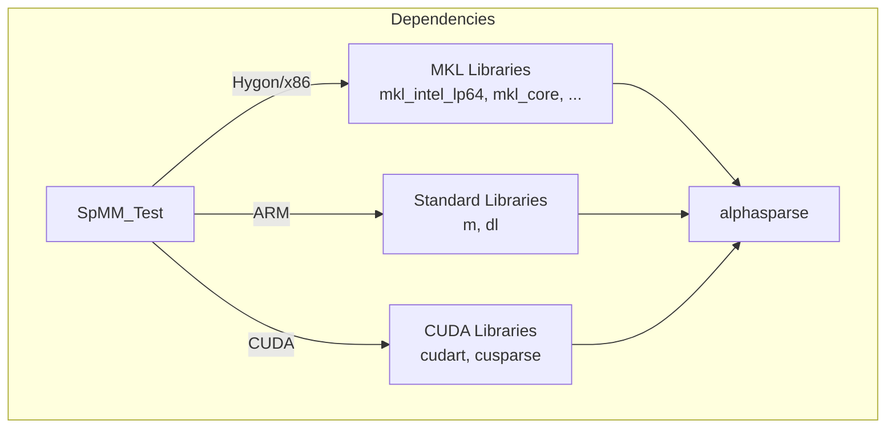
```mermaid
graph TD
    subgraph Dependencies
        SpMM_Test -->|Hygon/x86| MKL[MKL Libraries<br>mkl_intel_lp64, mkl_core, ...];
        SpMM_Test -->|ARM| StandardLibs[Standard Libraries<br>m, dl];
        SpMM_Test -->|CUDA| CUDALibs[CUDA Libraries<br>cudart, cusparse];
        MKL --> alphasparse;
        StandardLibs --> alphasparse;
        CUDALibs --> alphasparse;
    end
```

| Platform | Main Dependency Libraries |
| --- | --- |
| **Hygon (x86)** | `alphasparse`, `mkl_intel_lp64`, `mkl_intel_thread`, `mkl_core`, `iomp5` |
| **ARM** | `alphasparse`, `m`, `dl` |
| **CUDA** | `alphasparse`, `CUDA::cudart`, `CUDA::cusparse` |

Sources: hygon/test/CMakeLists.txt:10-17, arm/test/CMakeLists.txt:10-13, cuda/test/CMakeLists.txt:12-16

### Test Parameter Parsing

The test executable supports configuration via command-line arguments, such as specifying the input matrix file, data type, layout, and operation type. These parameters are parsed by functions defined in `args.h`.

| Function | Description |
| --- | --- |
| `args_get_data_fileA` | Get the file path of input matrix A. |
| `args_get_data_fileB` | Get the file path of input matrix B. |
| `alpha_args_get_layout` | Get the memory layout of the matrix (row-major or column-major). |
| `alpha_args_get_transA` | Get the transpose operation type of matrix A. |
| `alpha_args_get_format` | Get the storage format of the sparse matrix (e.g., CSR, COO). |
| `alpha_args_get_data_type` | Get the data type of the matrix elements. |

Sources: cuda/test/include/args.h:47-81, hip/test/include/args.h:44-71

## API Interface Definition

The AlphaSparse library provides a unified API style for different data types and sparse formats. The following is an example function declaration for the `add` operation (a generalized SpMM) for single-precision complex CSR matrices.

```c
// include/alphasparse/kernel_plain/kernel_csr_c.h:5alphasparseStatus_t add_c_csr_plain(const spmat_csr_c_t *A, const ALPHA_Complex8 alpha, const spmat_csr_c_t *B, spmat_csr_c_t **C);
```

This function implements the operation `C = alpha * A + B` and is part of Level 3 sparse computation. The `_plain` suffix indicates a generic C-language implementation that serves as the basis or reference for other platform-specific optimized versions.

Sources: include/alphasparse/kernel_plain/kernel_csr_c.h:5, include/alphasparse/kernel_plain/kernel_bsr_c.h:3
Error: Invalid operation: The `response.text` quick accessor requires the response to contain a valid `Part`, but none were returned. The candidate’s [finish_reason](https://ai.google.dev/api/generate-content#finishreason) is 1.

---

## CUDA Backend Implementation

### Related Pages

Related topics: [Architecture Overview](about:blank#page-arch-overview), [HIP Backend Implementation](about:blank#page-backend-hip)

- Relevant source files
    
    The following files were used as context for generating this wiki page:
    
    - [cuda/kernel/level3/csrspgemm_device_ac.h](cuda/kernel/level3/csrspgemm_device_ac.h)
    - [cuda/kernel/level3/ac/MultiplyKernels.h](cuda/kernel/level3/ac/MultiplyKernels.h)
    - [cuda/kernel/level3/csrspgemm_device_fast.h](cuda/kernel/level3/csrspgemm_device_fast.h)
    - [cuda/kernel/level3/fast/SparseDeviceMatrixCSROperations.h](cuda/kernel/level3/fast/SparseDeviceMatrixCSROperations.h)
    - [cuda/test/CMakeLists.txt](cuda/test/CMakeLists.txt)
    - [cuda/kernel/level3/fast/CudaComponentWise.h](cuda/kernel/level3/fast/CudaComponentWise.h)
    - [cuda/test/include/common.h](cuda/test/include/common.h)

# CUDA Backend Implementation

The CUDA backend provides the Alphasparse library with the ability to perform high-performance sparse linear algebra computations on NVIDIA GPUs. It leverages the CUDA programming model to accelerate key sparse computing tasks, especially sparse matrix-vector multiplication (SpMV) and sparse matrix-matrix multiplication (SpGEMM). This backend contains multiple algorithm implementations to adapt to the characteristics and computing needs of different sparse matrices, and maximizes hardware utilization through fine-grained memory management and parallelization strategies.

This document details the main components, core algorithm implementations, build system, and key kernel functions of the CUDA backend.

## Sparse Matrix-Matrix Multiplication (SpGEMM)

SpGEMM is one of the core features of the CUDA backend, providing two main implementation strategies: an advanced, multi-stage algorithm named `ac-SpGEMM`, and a `fast-SpGEMM` algorithm based on row-length classification.

### Advanced `ac-SpGEMM` Algorithm

`ac-SpGEMM` is a complex yet efficient algorithm designed to handle matrix multiplication of various sizes and sparsity patterns. It decomposes the computation process into multiple stages and handles intermediate results through dynamic memory management and an adaptive merge strategy.

The main logic of `ac-SpGEMM` is encapsulated by the `AcSpGEMMKernels` class, which defines the CUDA kernels required for each stage of the algorithm.

Sources: cuda/kernel/level3/ac/MultiplyKernels.h:40-43, cuda/kernel/level3/csrspgemm_device_ac.h:121-124

### Algorithm Flow

The execution flow of `ac-SpGEMM` is a cyclic process: it first computes intermediate results (called "chunks"), then merges these chunks as needed until all computations are complete. If intermediate memory is insufficient, the algorithm automatically reallocates and restarts the computation.

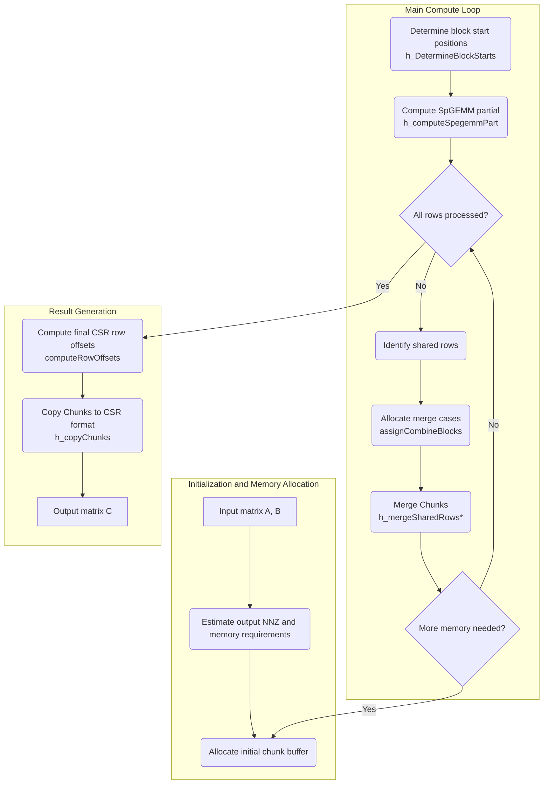
```mermaid
graph TD
    subgraph "Initialization and Memory Allocation"
        A[Input matrix A, B] --> B1(Estimate output NNZ and memory requirements);
        B1 --> B2(Allocate initial chunk buffer);
    end

    subgraph "Main Compute Loop"
        C1(Determine block start positions<br>h_DetermineBlockStarts) --> C2(Compute SpGEMM partial<br>h_computeSpegemmPart);
        C2 --> C3{All rows processed?};
        C3 -- No --> C4(Identify shared rows);
        C4 --> C5(Allocate merge cases<br>assignCombineBlocks);
        C5 --> C6(Merge Chunks<br>h_mergeSharedRows*);
        C6 --> C7{More memory needed?};
        C7 -- Yes --> B2;
        C7 -- No --> C3;
    end

    subgraph "Result Generation"
        C3 -- Yes --> D1(Compute final CSR row offsets<br>computeRowOffsets);
        D1 --> D2(Copy Chunks to CSR format<br>h_copyChunks);
        D2 --> E[Output matrix C];
    end
```

**Figure 1: `ac-SpGEMM` Algorithm Execution Flow**
This flow shows the complete steps from input to the final output matrix, including the core compute and merge loops.

Sources: cuda/kernel/level3/csrspgemm_device_ac.h:352-475

### Key Kernel Functions

The `AcSpGEMMKernels` class defines all the core kernels of the `ac-SpGEMM` algorithm.

| Function Template | Description |
| --- | --- |
| `h_DetermineBlockStarts` | Determines the starting position of the non-zero elements processed by each CUDA block. |
| `h_computeSpgemmPart` | The main compute stage of SpGEMM, generating intermediate result chunks. This kernel selects different sort modes (`SORT_TYPE_MODE`) based on matrix dimensions. |
| `h_mergeSharedRowsSimple` | Handles simple merge cases where all intermediate results of one row can be placed into shared memory for merging. |
| `h_mergeSharedRowsMaxChunks` | Handles moderately complex merge cases, used when the number of chunks for a row exceeds the simple merge limit but is within a maximum value (`MERGE_MAX_CHUNKS`). |
| `h_mergeSharedRowsGeneralized` | Handles the most complex merge cases, using a general multi-path merge strategy when the number of chunks is very large. |
| `h_copyChunks` | After all computation and merging are complete, copies the final chunk data into the standard CSR matrix format. |
| `assignCombineBlocks` | Analyzes all rows that need merging and assigns them to the three different merge kernels above based on their chunk count. |

Sources: cuda/kernel/level3/ac/MultiplyKernels.h:51-140

### Merge Strategy

The core of `ac-SpGEMM` is its adaptive merge strategy. After the compute stage, the system identifies rows computed by multiple CUDA blocks that produce partial results (called "shared rows"). The partial results of these rows need to be merged. The `assignCombineBlocks` function classifies them into three different merge kernels based on the number of chunks produced by each row.

- **Simple Case**: Applies to rows whose total chunk size can fit into shared memory.
- **Max Chunks Case**: Applies to rows whose chunk count exceeds the Simple Case but is still within a preset threshold.
- **Generalized Case**: Applies to rows with a very large chunk count, requiring more complex merge logic.

This classification aims to select the most efficient CUDA kernel for merge tasks of different complexity, thereby optimizing overall performance.

Sources: cuda/kernel/level3/csrspgemm_device_ac.h:145-177, cuda/kernel/level3/ac/MultiplyKernels.h:136-138

### `fast-SpGEMM` Algorithm

`fast-SpGEMM` is another SpGEMM implementation that adopts a strategy of classification and scheduling based on the row length of input matrix A (i.e., the number of non-zero elements per row). It groups rows with similar row lengths and calls specially optimized CUDA kernels for each group.

The core idea of this method is that for rows with different numbers of non-zero elements, the optimal parallelization strategy (e.g., how much work each thread, warp, or block handles) differs.

Sources: cuda/kernel/level3/csrspgemm_device_fast.h

### Kernel Scheduling

The algorithm first predicts the number of non-zero elements per row of output matrix C through the `PredictCSize` function, then groups rows into 13 queues based on the row length of input matrix A. Each queue corresponds to a specific row length range.

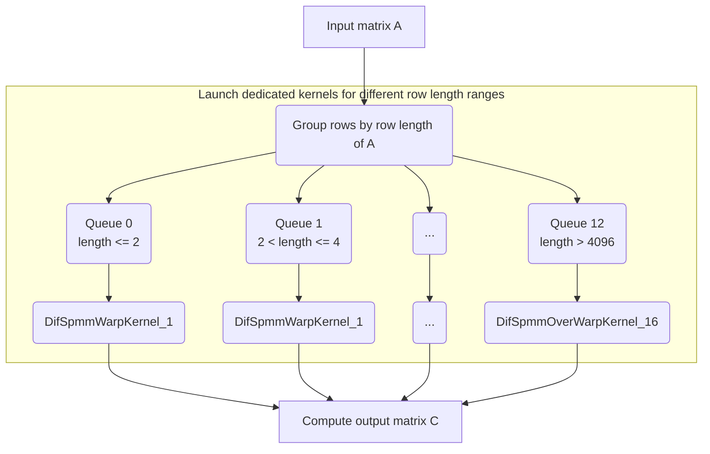
```mermaid
graph TD
    A[Input matrix A] --> B(Group rows by row length of A)
    subgraph "Launch dedicated kernels for different row length ranges"
        B --> Q1("Queue 0<br>length <= 2");
        B --> Q2("Queue 1<br>2 < length <= 4");
        B --> Q3("...");
        B --> Q12("Queue 12<br>length > 4096");

        Q1 --> K1("DifSpmmWarpKernel_1");
        Q2 --> K2("DifSpmmWarpKernel_1");
        Q3 --> K3("...");
        Q12 --> K12("DifSpmmOverWarpKernel_16");
    end
    K1 --> C[Compute output matrix C];
    K2 --> C;
    K3 --> C;
    K12 --> C;
```

**Figure 2: `fast-SpGEMM` Row-Length-Based Kernel Scheduling**
This diagram illustrates how rows are assigned to different queues based on the number of non-zero elements in a row, and how a specific CUDA kernel is called for each queue.

Sources: cuda/kernel/level3/csrspgemm_device_fast.h:541-610, cuda/kernel/level3/csrspgemm_device_fast.h:150-219

### Kernel Types

`fast-SpGEMM` uses two main kernel paradigms:

1. **Warp Kernels** (`DifSpmmWarpKernel_*`): Each warp is responsible for computing one row of the output matrix. This strategy is suitable for cases with short row lengths, because a warp (typically 32 threads) can efficiently process the row's computation in parallel.
2. **Over-Warp Kernels** (`DifSpmmOverWarpKernel_*`): Multiple warps or even the entire thread block cooperate to compute one row of the output matrix. This is suitable for cases with very long row lengths, where a single warp is insufficient.

The following table summarizes some kernels and their corresponding row lengths.

| Kernel Function | Target Row Length (A) | Parallel Strategy |
| --- | --- | --- |
| `DifSpmmWarpKernel_1<2>` | `<= 2` | Each thread processes 1 element; 2 threads (part of a warp) process one row. |
| `DifSpmmWarpKernel_1<32>` | `16 < length <= 32` | Each thread processes 1 element; one warp (32 threads) processes one row. |
| `DifSpmmWarpKernel_8<32>` | `128 < length <= 256` | Each thread processes 8 elements; one warp (32 threads) processes one row. |
| `DifSpmmOverWarpKernel_16<32,16>` | `> 4096` | Multiple warps cooperate to process one row; each thread processes 16 elements. |

Sources: cuda/kernel/level3/csrspgemm_device_fast.h:222-359

## Core CUDA Operations

In addition to SpGEMM, the CUDA backend also implements a series of fundamental sparse matrix and vector operations.

Sources: cuda/kernel/level3/fast/SparseDeviceMatrixCSROperations.h

### Sparse Matrix-Vector Multiplication (SpMV)

SpMV (Y = A*X) is implemented via the `CudaMulSparseMatrixCSRVector` function. Its core kernel `CudaMulSparseMatrixCSRVectorKernel` adopts a warp-per-row strategy.

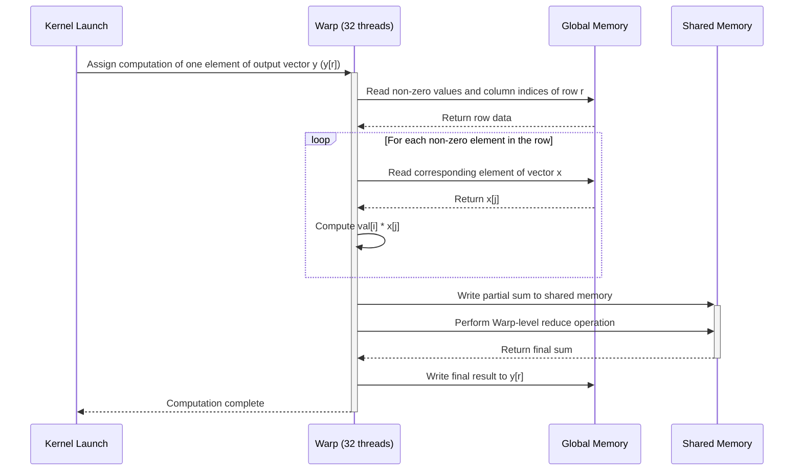
```mermaid
sequenceDiagram
    participant Kernel as Kernel Launch
    participant Warp as Warp (32 threads)
    participant GlobalMemory as Global Memory
    participant SharedMemory as Shared Memory

    Kernel->>+Warp: Assign computation of one element of output vector y (y[r])
    Warp->>GlobalMemory: Read non-zero values and column indices of row r
    GlobalMemory-->>Warp: Return row data
    loop For each non-zero element in the row
        Warp->>GlobalMemory: Read corresponding element of vector x
        GlobalMemory-->>Warp: Return x[j]
        Warp->>Warp: Compute val[i] * x[j]
    end
    Warp->>+SharedMemory: Write partial sum to shared memory
    Warp->>SharedMemory: Perform Warp-level reduce operation
    SharedMemory-->>-Warp: Return final sum
    Warp->>GlobalMemory: Write final result to y[r]
    Warp-->>-Kernel: Computation complete
```

**Figure 3: Execution Sequence of SpMV `CudaMulSparseMatrixCSRVectorKernel`**
This diagram shows how a CUDA warp loads data from global memory, performs reduction in shared memory, and finally writes the result back to compute one element of the output vector.

Sources: cuda/kernel/level3/fast/SparseDeviceMatrixCSROperations.h:182-205

### Other Operations

- **Transpose**: Provides a `Transpose` function to compute the transpose of a CSR-format sparse matrix. The process involves multiple steps: first generate expanded row indices, then sort the data by column index, and finally recompute the row offsets of the transposed matrix.
Sources: cuda/kernel/level3/fast/SparseDeviceMatrixCSROperations.h:142-167
- **Rank-One Update**: The `RankOneUpdate` function is used to update the non-zero element values of a sparse matrix, performing the operation `dst += scale * x * y^T`. This is an in-place update that only modifies the non-zero elements already present in `dst`.
Sources: cuda/kernel/level3/fast/SparseDeviceMatrixCSROperations.h:22-25, cuda/kernel/level3/fast/SparseDeviceMatrixCSROperations.h:169-180

## Build and Testing

The test cases for the CUDA backend are managed via `CMake`. The `cuda/test/CMakeLists.txt` file defines how to build each test executable.

A CMake function named `add_alphasparse_example` is used to simplify the creation of test targets.

```
# cuda/test/CMakeLists.txtfunction(add_alphasparse_example TEST_SOURCE)
  get_filename_component(TEST_TARGET ${TEST_SOURCE} NAME_WE)
  add_executable(${TEST_TARGET} ${TEST_SOURCE})
  target_compile_definitions(${TEST_TARGET} PUBLIC __CUDA_NO_HALF2_OPERATORS__)
  target_compile_definitions(${TEST_TARGET} PUBLIC CUDA_ARCH=${CUDA_ARCH})
  set_property(TARGET ${TEST_TARGET} PROPERTY CUDA_ARCHITECTURES ${CUDA_ARCH})
  # ... include directories and link libraries ...  target_link_libraries(${TEST_TARGET} PUBLIC      CUDA::cudart      CUDA::cusparse      alphasparse
    )
endfunction()
```

This function handles the creation of the executable, the setting of the CUDA architecture, and the linking with the CUDA runtime, cuSPARSE, and alphasparse libraries.

Sources: cuda/test/CMakeLists.txt:1-17

The test suite covers a wide range of features, including:
- **Level 2 BLAS**: `spmv_csr_r_f32_test.cu`, `spmv_coo_c_f64_test.cu`
- **Level 3 BLAS**: `spgemm_csr_r_f32_test.cu`, `spmm_coo_r_f64_test.cu`
- **Different data types**: Tests cover `f16`, `bf16`, `f32`, `f64`, `i8`, as well as complex types.
- **Preprocessors and reordering**: `csric02_r32_test.cu`, `csrcolor_r32_test.cu`

Tests for the BF16 data type are only enabled on devices with CUDA compute capability 8.0 or higher.

Sources: cuda/test/CMakeLists.txt:19-242

## Conclusion

The Alphasparse CUDA backend provides a powerful and flexible sparse computing framework. By providing multiple SpGEMM algorithms (such as `ac-SpGEMM` and `fast-SpGEMM`), it can select the optimal computing strategy based on the characteristics of the matrix. Combined with efficient SpMV kernels, a rich library of helper functions, and a comprehensive CMake test system, the CUDA backend ensures high performance and reliability on NVIDIA GPUs. These designs together form the core capability of the Alphasparse library for accelerating sparse linear algebra tasks in fields such as scientific computing and machine learning.

---

## HIP Backend Implementation

### Related Pages

Related topics: [Architecture Overview](about:blank#page-arch-overview), [CUDA Backend Implementation](about:blank#page-backend-cuda)

- Relevant source files
    
    The following files were used as context for generating this wiki page:
    
    - [hip/test/CMakeLists.txt](hip/test/CMakeLists.txt)
    - [hip/test/include/common.h](hip/test/include/common.h)
    - [hip/kernel/level2/spsv_csr_n_lo_nnz_balance.h](hip/kernel/level2/spsv_csr_n_lo_nnz_balance.h)
    - [hip/kernel/level3/speck/spECK_HashLoadBalancer.h](hip/kernel/level3/speck/spECK_HashLoadBalancer.h)
    - [include/alphasparse/kernel_dcu/kernel_csr_c_dcu.h](include/alphasparse/kernel_dcu/kernel_csr_c_dcu.h)
    - [cuda/kernel/level3/ac/MultiplyKernels.h](cuda/kernel/level3/ac/MultiplyKernels.h)
    - [hip/test/include/args.h](hip/test/include/args.h)

# HIP Backend Implementation

### Introduction

The HIP backend of AlphaSPARSE aims to provide high-performance sparse linear algebra computing capability for AMD GPUs. This backend is implemented using the HIP (Heterogeneous-compute Interface for Portability) programming model, ensuring efficient execution of the code on AMD hardware platforms. It provides concrete implementations for key sparse BLAS routines, including sparse matrix-vector multiplication (SpMV), sparse triangular solve (SpSV), and sparse matrix-matrix multiplication (SpGEMM). To ensure computational accuracy, the project includes a comprehensive test framework that compares the computation results of the AlphaSPARSE HIP kernels against AMD's rocSPARSE (hipSPARSE) library for verification.

### Build and Testing

The build and testing flow of the HIP backend is managed by `CMake`. The test code is located in the `hip/test/` directory, and its `CMakeLists.txt` file defines the compilation rules and dependencies of the test cases in detail.

Sources: hip/test/CMakeLists.txt

### Common Test Components

A set of common source files provides basic functionality for all HIP tests, such as command-line argument parsing, I/O operations, and result verification.

| File Name | Description |
| --- | --- |
| `args.hip` | Parses the command-line arguments of the test program. |
| `io.hip` | Responsible for reading matrix data from files. |
| `check.hip` | Provides functions for verifying the accuracy of computation results. |
| `check_r.hip` | Specific check functions for real-number types. |
| `warmup.hip` | Provides GPU warm-up functionality for more accurate performance measurements. |

Sources: hip/test/CMakeLists.txt:3-9

### Test Case Build Flow

The `add_alphasparse_example` function in `CMakeLists.txt` encapsulates the process of creating an executable for each test source file. This flow clearly shows the dependencies and compilation definitions of the test program.

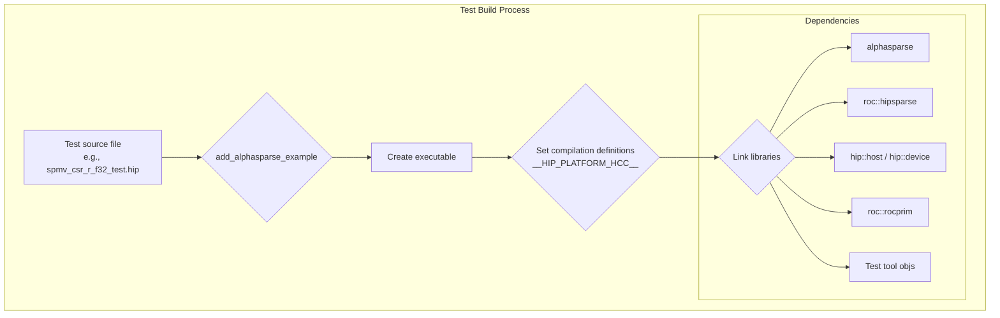
```mermaid
graph TD
    subgraph Test Build Process
        A[Test source file<br/>e.g., spmv_csr_r_f32_test.hip] --> B{add_alphasparse_example};
        B --> C[Create executable];
        C --> D{Set compilation definitions<br/>__HIP_PLATFORM_HCC__};
        D --> E{Link libraries};
        subgraph Dependencies
            E --> L1[alphasparse];
            E --> L2[roc::hipsparse];
            E --> L3[hip::host / hip::device];
            E --> L4[roc::rocprim];
            E --> L5[Test tool objs];
        end
    end
```

*This diagram shows how a HIP test source file is compiled into an executable via the `add_alphasparse_example` function and linked with all necessary dependency libraries.*

Sources: hip/test/CMakeLists.txt:17-45

The compiled test targets cover multiple sparse computing levels and data types, for example:
- `level2/spmv_csr_r_f32_test.hip`
- `level2/spsv_csr_r_f64_test_metrics.hip`
- `level3/spgemm_csr_r_f32_test.hip`
- `level3/spmm_csr_row_r_f64_test_hip_metrics.hip`

Sources: hip/test/CMakeLists.txt:59-75

### HIP/rocSPARSE Interoperability

To verify the correctness of the AlphaSPARSE HIP implementation, the test framework needs to interact with the rocSPARSE (hipSPARSE) library and compare results. This is achieved through enumeration type mappings defined in a series of header files, which convert the API parameters of AlphaSPARSE into the equivalent parameters of hipSPARSE.

The `hip/test/include/common.h` file is the core for implementing this interoperability. It defines the `std::map`s for converting from AlphaSPARSE enumerations to hipSPARSE enumerations.

| AlphaSPARSE Enum | hipSPARSE Enum | Mapping Table |
| --- | --- | --- |
| `alphasparseOperation_t` | `hipsparseOperation_t` | `alpha2cuda_op_map` |
| `alphasparse_fill_mode_t` | `hipsparseFillMode_t` | `alpha2cuda_fill_map` |
| `alphasparse_diag_type_t` | `hipsparseDiagType_t` | `alpha2cuda_diag_map` |
| `alphasparseOrder_t` | `hipsparseOrder_t` | `alpha2cuda_order_map` |
| `alphasparseDataType` | `hipDataType` | `alpha2cuda_datatype_map` |

*This table summarizes the key data structures used to convert AlphaSPARSE API calls into equivalent rocSPARSE calls during testing.*

Sources: hip/test/include/common.h:46-111

### Core Kernel Implementation

The HIP backend of AlphaSPARSE contains custom kernels optimized for different sparse operation levels.

### Level 2: SpSV (Sparse Triangular Solve)

For sparse triangular solve (SpSV), the repository implements an algorithm based on non-zero element (NNZ) load balancing, specifically for CSR-format matrices. This implementation is located in `hip/kernel/level2/spsv_csr_n_lo_nnz_balance.h`.

This algorithm adopts an Analysis-Solve two-stage approach:

1. **Analysis stage (`spsv_csr_n_lo_nnz_balance_analysis`)**:
    - This stage preprocesses the matrix to build the dependency information needed for the solve.
    - It computes the "in-degree" of each row, i.e., the number of other rows that must be computed before the current row can be computed during the triangular solve.
    - Optionally, this stage can reorder the rows (the `REORDER` template parameter) to improve parallelism.
2. **Solve stage (`spsv_csr_n_lo_nnz_balance_solve_kernel`)**:
    - This is a `__global__` HIP kernel that launches one thread per non-zero element.
    - The kernel uses atomic operations (`atomicAdd`, `atomicSub`) and memory fences (`__threadfence`) to safely handle dependencies between rows.
    - When all dependencies of a row are computed (i.e., `in_degree` is decremented to 1), the thread responsible for the diagonal element computes the final solution of that row and marks it as complete, unlocking other computations that depend on this row.

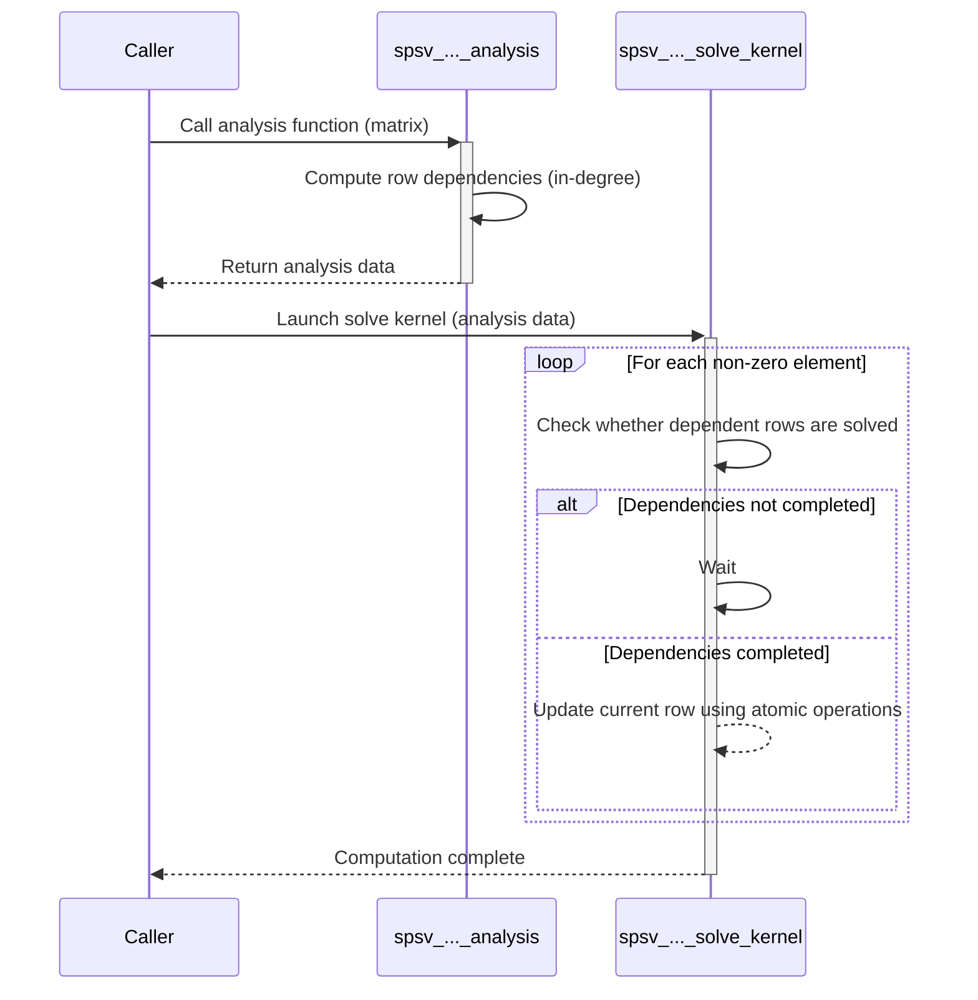
```mermaid
sequenceDiagram
    participant C as Caller
    participant A as spsv_..._analysis
    participant S as spsv_..._solve_kernel

    C->>+A: Call analysis function (matrix)
    A->>A: Compute row dependencies (in-degree)
    A-->>-C: Return analysis data
    C->>+S: Launch solve kernel (analysis data)
    loop For each non-zero element
        S->>S: Check whether dependent rows are solved
        alt Dependencies not completed
            S->>S: Wait
        else Dependencies completed
            S-->>S: Update current row using atomic operations
        end
    end
    S-->>-C: Computation complete
```

*This diagram describes the analysis-solve flow of SpSV. The analysis stage prepares dependency information, and the solve kernel uses this information to complete the computation in parallel via atomic operations.*

Sources: hip/kernel/level2/spsv_csr_n_lo_nnz_balance.h:35-212

### Level 3: SpGEMM (Sparse Matrix-Matrix Multiplication)

The project implements multiple complex GPU kernel strategies for SpGEMM, aimed at optimizing the multiplication performance of different types of sparse matrices.

### spECK Load Balancing Strategy

`spECK` is a hash-based SpGEMM implementation whose core is efficient load balancing. The `h_AssignHashSpGEMMBlocksToRowsOfSameSize` function in `spECK_HashLoadBalancer.h` implements the logic of grouping rows with similar computation load (similar row lengths) into the same compute block.

The process is as follows:
1. **Read row length**: The `RowLengthReader` structure reads the number of non-zero elements per row from the row pointer array of the input matrix.
2. **Range merging**: The `CombineRangesOfSameSize` functor merges consecutive rows of the same size (or similar computation amount) into one work range.
3. **Prescan and allocation**: The `prescanArrayOrdered` function scans all rows and uses the merge logic to create the final block allocation scheme.
4. **Consumer**: The `BlockRangeConsumer` writes the generated block allocation information into the output buffer.

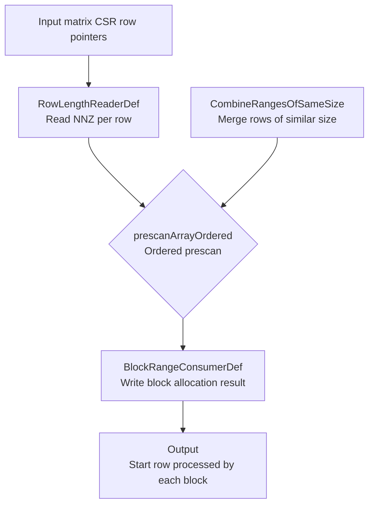
```mermaid
graph TD
    A[Input matrix CSR row pointers] --> B[RowLengthReaderDef<br>Read NNZ per row];
    B --> C{prescanArrayOrdered<br>Ordered prescan};
    D[CombineRangesOfSameSize<br>Merge rows of similar size] --> C;
    C --> E[BlockRangeConsumerDef<br>Write block allocation result];
    E --> F[Output<br>Start row processed by each block];
```

*This diagram shows the row allocation flow used for load balancing in spECK SpGEMM, which groups similar rows to optimize GPU resource utilization.*

Sources: hip/kernel/level3/speck/spECK_HashLoadBalancer.h:73-120

### Ac-SpGEMM Kernel

The `cuda/kernel/level3/ac/MultiplyKernels.h` file defines the kernel interface for another SpGEMM implementation (`AcSpGEMM`). Although the path is `cuda`, its design philosophy (such as staged computation) is generally applicable to common GPU programming models, including HIP. This file defines several templated kernel functions, suggesting a multi-stage computation process that may include:
- `h_DetermineBlockStarts`: Determines the starting work point of each block.
- `h_computeSpgemmPart`: Performs partial computation of SpGEMM.
- `h_mergeSharedRowsSimple` / `h_mergeSharedRowsMaxChunks`: Merge intermediate results computed by different thread blocks or warps.

Sources: cuda/kernel/level3/ac/MultiplyKernels.h:60-96

### DCU/HIP API Interface

AlphaSPARSE provides a set of explicit C APIs for the HIP backend (also called DCU in the AMD ecosystem). These interfaces are declared in header files under the `include/alphasparse/kernel_dcu/` directory. These functions serve as a bridge between upper-layer applications and the underlying HIP kernels.

The following table lists some representative DCU API functions:

| Function | Description | Source File |
| --- | --- |
| `dcu_gemv_c_csr` | General sparse matrix-vector multiplication (GEMV), for CSR format, single-precision complex. | `kernel_csr_c_dcu.h` |
| `dcu_hermv_c_csr_n_hi_trans` | Hermitian matrix-vector multiplication, using the upper triangular part of the matrix for transpose computation. | `kernel_csr_c_dcu.h` |
| `dcu_trmv_c_csr_n_lo` | Triangular matrix-vector multiplication, using the lower triangular part of the matrix. | `kernel_csr_c_dcu.h` |
| `dcu_gemm_z_bsr` | General sparse matrix-dense matrix multiplication (GEMM), for BSR format, double-precision complex. | `kernel_bsr_z_dcu.h` |
| `dcu_trmv_z_bsr_u_hi_trans` | Unit triangular matrix-vector multiplication, using the upper triangular part of the matrix for transpose computation. | `kernel_bsr_z_dcu.h` |

Sources: include/alphasparse/kernel_dcu/kernel_csr_c_dcu.h, include/alphasparse/kernel_dcu/kernel_bsr_z_dcu.h

### Conclusion

The HIP backend of AlphaSPARSE provides a feature-rich and high-performance sparse computing solution for AMD GPUs. Through the HIP programming model, it achieves hardware-independent portability. The backend combines custom advanced kernels (such as dependency-driven kernels for SpSV and complex load-balancing strategies for SpGEMM) with interoperability with the rocSPARSE library, ensuring the robustness and accuracy of its functionality. The clear API design and comprehensive test framework make it a reliable GPU-accelerated sparse computing library.

---

## CPU Backend Implementation (ARM & Hygon)

### Related Pages

Related topics: [Architecture Overview](about:blank#page-arch-overview)

- Relevant source files
    
    The following files were used as context for generating this wiki page:
    
    - [hygon/test/CMakeLists.txt](hygon/test/CMakeLists.txt)
    - [arm/test/CMakeLists.txt](arm/test/CMakeLists.txt)
    - [hygon/kernel/CMakeLists.txt](hygon/kernel/CMakeLists.txt)
    - [hygon/kernel/level2/mv/symv/symv_bsr_u_lo_conj.hpp](hygon/kernel/level2/mv/symv/symv_bsr_u_lo_conj.hpp)
    - [arm/kernel/level2/mv/symv/symv_bsr_u_lo_conj.hpp](arm/kernel/level2/mv/symv/symv_bsr_u_lo_conj.hpp)

# CPU Backend Implementation (ARM & Hygon)

This project provides independent backend implementations for different CPU architectures (especially Hygon x86-64 and ARM). This approach allows leveraging platform-specific optimizations and libraries for each platform to achieve optimal performance. The Hygon backend leverages the Intel MKL library and specific FMA (Fused Multiply-Add) assembly instructions, while the ARM backend relies on standard math and dynamic linking libraries.

The two backends share the logic of part of the high-level C++ kernel code, but differ significantly in the build process, library dependencies, and low-level optimizations. The test suites are also configured separately for each architecture to ensure correctness and performance on their respective platforms.

## Build System and Dependencies

The project's build system uses CMake to manage the compilation and linking process for different CPU backends. Platform-specific configurations are handled through separate `CMakeLists.txt` files in different directories (`hygon/` and `arm/`).

Sources: hygon/test/CMakeLists.txt, arm/test/CMakeLists.txt

### Library Linking

The most notable difference is in the dependency on external libraries. The Hygon backend links the Intel Math Kernel Library (MKL), while the ARM backend uses the standard `m` and `dl` libraries.

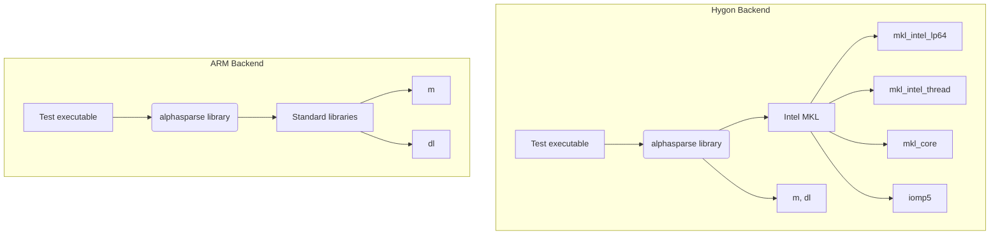
```mermaid
graph TD
    subgraph Hygon Backend
        A[Test executable] --> B(alphasparse library)
        B --> C[Intel MKL]
        C --> D[mkl_intel_lp64]
        C --> E[mkl_intel_thread]
        C --> F[mkl_core]
        C --> G[iomp5]
        B --> H[m, dl]
    end
    subgraph ARM Backend
        X[Test executable] --> Y(alphasparse library)
        Y --> Z[Standard libraries]
        Z --> Z1[m]
        Z --> Z2[dl]
    end
```

*The figure above shows the different linking dependencies of the Hygon and ARM backend test programs.*

The following table summarizes the differences in linked libraries:

| Library | Hygon (`hygon/test/CMakeLists.txt`) | ARM (`arm/test/CMakeLists.txt`) | Description |
| --- | --- | --- | --- |
| `alphasparse` | ✓ | ✓ | Core sparse computing library of the project |
| `mkl_intel_lp64` | ✓ | ✗ | Intel MKL 64-bit integer interface layer |
| `mkl_intel_thread` | ✓ | ✗ | Intel MKL OpenMP threading layer |
| `mkl_core` | ✓ | ✗ | MKL core computation library |
| `iomp5` | ✓ | ✗ | Intel OpenMP runtime library |
| `m` | ✓ | ✓ | Standard math library |
| `dl` | ✓ | ✓ | Dynamic linking library |

Sources: hygon/test/CMakeLists.txt:14-23, arm/test/CMakeLists.txt:13-17

### Test Targets

Both platforms use a CMake function named `add_alphasparse_example` to define and build test executables. Although the test file names are mostly the same across the two platforms (e.g., `level3/mm_hygon_test.cpp`), they are compiled and linked independently for their respective platforms.

**Hygon Test Target Examples:**

```
add_alphasparse_example(level2/mv_hygon_test.cpp)
add_alphasparse_example(level3/mm_hygon_test.cpp)
add_alphasparse_example(level3/spmm_csr_d_hygon_test.cpp)
```

Sources: hygon/test/CMakeLists.txt:28-45

**ARM Test Target Examples:**

```
add_alphasparse_example(level2/mv_hygon_test.cpp)
add_alphasparse_example(level3/mm_hygon_test.cpp)
add_alphasparse_example(level3/spmm_csr_d_hygon_test.cpp)
```

Sources: arm/test/CMakeLists.txt:22-39

## Kernel Implementation

The kernel implementation of the Hygon backend includes C++ source files and assembly (.S) files specific to the x86 architecture for extreme optimization.

Sources: hygon/kernel/CMakeLists.txt

### Hygon Kernel Source Files

The source code of the Hygon kernel is defined in `hygon/kernel/CMakeLists.txt`. It is divided into C++ implementation and assembly implementation.

**C++ Source Files (`alphasparse_source`):**
- `kernel/level1/alphasparse_axpy.cpp`
- `kernel/level2/alphasparse_mv.cpp`
- `kernel/level2/alphasparse_trsv.cpp`
- `kernel/level3/alphasparse_mm.cpp`
- `kernel/level3/alphasparse_spmm.cpp`
- …, etc.

Sources: hygon/kernel/CMakeLists.txt:1-17

**Assembly Source Files (`ASM_SOURCES`):**
These files provide hand-written optimizations for specific operations (such as GEMV).
- `kernel/level2/mv/gemv/csrmv/gemv_csr_serial_fma_c8_u2.S`
- `kernel/level2/mv/gemv/csrmv/gemv_csr_serial_fma_fp32_u8_ext.S`
- `kernel/level2/mv/gemv/csrmv/gemv_csr_serial_fma_fp64_u4.S`
- `kernel/level2/mv/gemv/ellmv/ellsgemv_fma128.S`
- …, etc.

Sources: hygon/kernel/CMakeLists.txt:20-33

### C++ Kernel Code Comparison

By comparing the `symv_bsr_u_lo_conj.hpp` files, it can be seen that the Hygon and ARM backends currently share the same high-level C++ kernel code. The logic in the two files is completely identical, which indicates that in some cases the code is cross-platform portable, while performance differences mainly come from low-level library and assembly-level optimizations.

The following is a simplified flow of the core computation loop in this kernel:

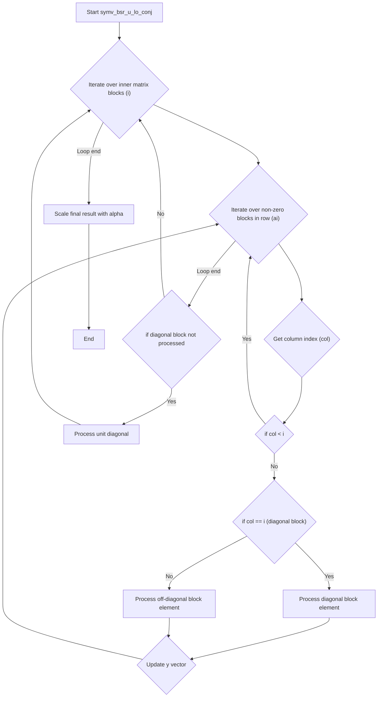
```mermaid
graph TD
    A["Start symv_bsr_u_lo_conj"] --> B{"Iterate over inner matrix blocks (i)"}
    B --> C{"Iterate over non-zero blocks in row (ai)"}
    C --> D{"Get column index (col)"}
    D --> E{"if col < i"}
    E -- "Yes" --> C
    E -- "No" --> F{"if col == i (diagonal block)"}
    F -- "Yes" --> G["Process diagonal block element"]
    F -- "No" --> H["Process off-diagonal block element"]
    G --> I
    H --> I{"Update y vector"}
    I --> C

    C -- "Loop end" --> J{"if diagonal block not processed"}
    J -- "Yes" --> K["Process unit diagonal"]
    K --> B
    J -- "No" --> B

    B -- "Loop end" --> L["Scale final result with alpha"]
    L --> M["End"]

```

*The figure above shows the general logic for handling symmetric block sparse matrix-vector multiplication in `symv_bsr_u_lo_conj.hpp`.*

Code snippet example (identical for Hygon and ARM):

```cpp
// hygon/kernel/level2/mv/symv/symv_bsr_u_lo_conj.hppfor(ALPHA_INT i = 0; i < m_inner; ++i){    ALPHA_INT m_s = i*bs;    for(ALPHA_INT ai = A->row_data[i]; ai < A->row_data[i+1]; ++ai)    {        const ALPHA_INT col = A->col_data[ai];        if(col < i)        {            continue;        }        else if(col == i)        {            diag_block = 1;            // ... diagonal block handling ...        }        else        {            // ... off-diagonal block handling ...        }    }    if (diag_block == 0){        // ... unit diagonal handling ...    }}
```

Sources: hygon/kernel/level2/mv/symv/symv_bsr_u_lo_conj.hpp:34-80, arm/kernel/level2/mv/symv/symv_bsr_u_lo_conj.hpp:34-80

## Summary

The CPU backend implementation of this project adopts different strategies for the Hygon and ARM platforms. The Hygon backend is deeply optimized by linking the Intel MKL and using hand-written assembly code. In contrast, the ARM backend relies on more general-purpose libraries, but shares code with the Hygon backend at the high-level C++ kernel layer. This modular design makes it possible to provide specialized optimizations for different hardware platforms while maximizing code reuse. The build system uses CMake to precisely control the compilation and linking process of each backend, ensuring platform independence and correctness.

---

## Testing Guide

### Related Pages

Related topics: [Build Guide](about:blank#page-build-guide)

- Relevant source files
    
    The following files were used as context for generating this wiki page:
    
    - [hygon/test/CMakeLists.txt](hygon/test/CMakeLists.txt)
    - [arm/test/CMakeLists.txt](arm/test/CMakeLists.txt)
    - [cuda/test/CMakeLists.txt](cuda/test/CMakeLists.txt)
    - [cuda/kernel/level3/csrspgemm_device_ac.h](cuda/kernel/level3/csrspgemm_device_ac.h)
    - [cuda/kernel/level3/ac/MultiplyKernels.h](cuda/kernel/level3/ac/MultiplyKernels.h)

# Testing Guide

The AlphaSparse library includes a comprehensive test suite designed to ensure correctness and performance across multiple hardware architectures (including Hygon x86, ARM, and NVIDIA CUDA). The test framework is managed using CMake, providing a unified interface for adding and building test cases. This guide outlines the structure of the test system, platform-specific configurations, and test coverage.

## Test Build System

The project uses CMake to automate the compilation and linking of test executables. The core mechanism is a custom CMake function named `add_alphasparse_example`, which encapsulates the common logic for adding tests on different platforms.

Sources: hygon/test/CMakeLists.txt:1-26, arm/test/CMakeLists.txt:1-20, cuda/test/CMakeLists.txt:1-20

### `add_alphasparse_example` Function

This function is the standard way to add new test cases to the build system. It handles tasks such as deriving the target name from the source file name, setting include directories, and linking the required libraries.

The following flowchart illustrates the operation of this function:

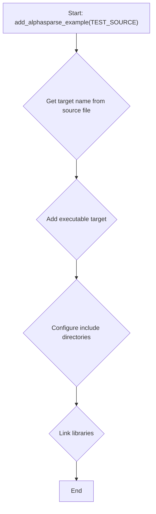
```mermaid
graph TD
    A["Start: add_alphasparse_example(TEST_SOURCE)"] --> B{"Get target name from source file"}
    B --> C{"Add executable target"}
    C --> D{"Configure include directories"}
    D --> E{"Link libraries"}
    E --> F["End"]

```

*Figure 1: The workflow of the `add_alphasparse_example` function.*
Sources: hygon/test/CMakeLists.txt:1-26

This function links the `alphasparse` core library and any platform-specific dependencies according to the target platform.

## Platform-Specific Build

The test build system is customized for different target architectures, each with its unique compilation definitions and library dependencies.

### Hygon (x86) Build

For the Hygon platform, the tests heavily rely on the Intel Math Kernel Library (MKL) for performance comparison and verification.

**Linker Dependencies**

The following table summarizes the key libraries linked by the Hygon tests.

| Library | Description |
| --- | --- |
| `alphasparse` | Core AlphaSparse library under test |
| `mkl_intel_lp64` | Intel MKL 64-bit interface library (LP64) |
| `mkl_intel_thread` | Intel MKL threading layer |
| `mkl_core` | Intel MKL core functionality library |
| `iomp5` | Intel OpenMP runtime library |
| `m` | Standard math library |
| `dl` | Dynamic linking library |

Sources: hygon/test/CMakeLists.txt:13-21

**Test Case Examples**

- `level2/mv_hygon_test.cpp`
- `level3/mm_hygon_test.cpp`
- `level3/spmm_csr_d_hygon_test.cpp`

Sources: hygon/test/CMakeLists.txt:28-50

### ARM Build

The build configuration for the ARM platform is simpler, not depending on a vendor-specific math library such as MKL.

**Linker Dependencies**

| Library | Description |
| --- | --- |
| `alphasparse` | Core AlphaSparse library under test |
| `m` | Standard math library |
| `dl` | Dynamic linking library |

Sources: arm/test/CMakeLists.txt:13-17

**Test Case Examples**

- `level2/sv_csr_s_hygon_test.cpp`
- `level3/trsm_csr_s_hygon_test.cpp`
- `level3/add_s_csr_x86_64_test.cpp`

Sources: arm/test/CMakeLists.txt:23-44

### CUDA Build

CUDA tests require specific compiler definitions and libraries from the NVIDIA CUDA toolkit.

**Compiler Definitions and Properties**

- `__CUDA_NO_HALF2_OPERATORS__`: Disables the built-in operators for the `half2` type.
- `CUDA_ARCH`: Defines the target CUDA SM architecture (e.g., 70, 80).
- `CUDA_ARCHITECTURES`: Sets the CUDA architecture property of the target executable.

Sources: cuda/test/CMakeLists.txt:4-6

**Linker Dependencies**

| Library | Description |
| --- | --- |
| `CUDA::cudart` | CUDA runtime library |
| `CUDA::cudart_static` | Static CUDA runtime library |
| `CUDA::cusparse` | NVIDIA cuSPARSE library |
| `CUDA::cusparse_static` | Static NVIDIA cuSPARSE library |
| `alphasparse` | Core AlphaSparse library under test |

Sources: cuda/test/CMakeLists.txt:13-19

**Conditional Compilation**

The codebase includes conditional compilation for specific CUDA architectures. For example, tests for the `bfloat16` data type are only compiled when `CUDA_ARCH` is greater than or equal to 80, because this requires Ampere or newer hardware support.

Sources: cuda/test/CMakeLists.txt:21-39

## CUDA Kernel Test Coverage

CUDA tests not only verify the high-level API but also cover complex low-level kernel implementations, such as the `ac-SpGEMM` algorithm for sparse matrix-sparse matrix multiplication (SpGEMM).

### ac-SpGEMM Kernels

`ac-SpGEMM` is a high-performance SpGEMM algorithm whose implementation is divided into multiple stages. The test suite aims to verify the correctness of each of these stages.

**Key Kernel Functions**

- `h_computeSpgemmPart`: Executes the core compute stage of SpGEMM.
- `h_mergeSharedRowsSimple`: Merges intermediate results computed by different thread blocks (simple case).
- `h_mergeSharedRowsMaxChunks`: Handles intermediate results requiring more complex merge logic.
- `h_mergeSharedRowsGeneralized`: A general-purpose merge implementation.
- `h_copyChunks`: Copies the final chunked linked-list result into the standard CSR format.

Sources: cuda/kernel/level3/ac/MultiplyKernels.h:71-155

### SpGEMM Device-Side Logic

The device-side code (`csrspgemm_device_ac.h`) is responsible for selecting and launching the appropriate `ac-SpGEMM` kernel variant based on the characteristics of the input matrices. This complex logic is the focus of testing to ensure the correct code path is selected in all cases.

The following diagram illustrates the kernel selection logic for the SpGEMM compute stage:

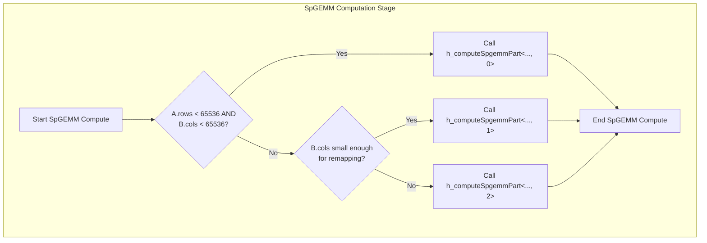
```mermaid
graph TD
    subgraph SpGEMM Computation Stage
        Start[Start SpGEMM Compute] --> Cond1{A.rows < 65536 AND<br>B.cols < 65536?};
        Cond1 -- Yes --> Case1[Call h_computeSpgemmPart<..., 0>];
        Cond1 -- No --> Cond2{B.cols small enough<br>for remapping?};
        Cond2 -- Yes --> Case2[Call h_computeSpgemmPart<..., 1>];
        Cond2 -- No --> Case3[Call h_computeSpgemmPart<..., 2>];
        Case1 --> End[End SpGEMM Compute];
        Case2 --> End;
        Case3 --> End;
    end
```

*Figure 2: SpGEMM kernel selection logic.*
Sources: cuda/kernel/level3/csrspgemm_device_ac.h:35-85

This dimension-based conditional dispatch ensures optimal performance and resource utilization in different scenarios, while also increasing the complexity of testing. Test cases must cover these different branches to ensure the robustness of the algorithm.

---

## Utility Scripts

### Related Pages

Related topics: [Testing Guide](about:blank#page-testing-guide)

- Relevant source files
    
    The following files were used as context for generating this wiki page:
    
    - [hygon/test/CMakeLists.txt](hygon/test/CMakeLists.txt)
    - [arm/test/CMakeLists.txt](arm/test/CMakeLists.txt)
    - [cuda/test/CMakeLists.txt](cuda/test/CMakeLists.txt)
    - [include/alphasparse/kernel_plain/kernel_csr_c.h](include/alphasparse/kernel_plain/kernel_csr_c.h)
    - [include/alphasparse/kernel_plain/kernel_dia_c.h](include/alphasparse/kernel_plain/kernel_dia_c.h)
    - [include/alphasparse/kernel_plain/kernel_csc_c.h](include/alphasparse/kernel_plain/kernel_csc_c.h)
    - [include/alphasparse/kernel_plain/kernel_coo_c.h](include/alphasparse/kernel_plain/kernel_coo_c.h)
    - [include/alphasparse/kernel_plain/kernel_csr_z.h](include/alphasparse/kernel_plain/kernel_csr_z.h)
    - [hygon/kernel/level2/mv/symv/symv_bsr_u_lo_conj.hpp](hygon/kernel/level2/mv/symv/symv_bsr_u_lo_conj.hpp)
    - [arm/kernel/level2/mv/symv/symv_bsr_u_lo_conj.hpp](arm/kernel/level2/mv/symv/symv_bsr_u_lo_conj.hpp)
    - [include/alphasparse/kernel_dcu/kernel_bsr_c_dcu.h](include/alphasparse/kernel_dcu/kernel_bsr_c_dcu.h)
    - [include/alphasparse/kernel_dcu/kernel_csr_c_dcu.h](include/alphasparse/kernel_dcu/kernel_csr_c_dcu.h)

# Conjugate Operations

## Introduction

The AlphaSparse library provides support for conjugate operations on sparse matrix computations involving complex numbers (`ALPHA_Complex8` and `ALPHA_Complex16`). This feature is part of the sparse BLAS Level 2 (matrix-vector operations) and Level 3 (matrix-matrix operations) routines, and is especially critical when dealing with the conjugate transpose (Hermitian transpose).

Conjugate operations are widely used across multiple sparse matrix formats, including CSR, CSC, BSR, DIA, and COO, and ensure functional consistency across different hardware backends (such as x86, ARM, CUDA, and DCU). These operations are typically identified by adding the `_conj` suffix to the function name.

## Core Functionality and Implementation

The core of the conjugate operation is to take the conjugate of the non-zero elements of the sparse matrix `A` during matrix operations. This is a standard step when computing expressions such as `alpha*A^H*x`, where `A^H` denotes the conjugate transpose of `A`.

In the BSR `symv` (symmetric matrix-vector multiplication) kernel implementations for the Hygon and ARM platforms, the direct logic of applying the conjugate operation to matrix elements can be seen.

```cpp
// hygon/kernel/level2/mv/symv/symv_bsr_u_lo_conj.hpp:22-24TYPE cv = ((TYPE *)A->val_data)[s1+ai*bs*bs];cv = cmp_conj(cv);y[m_s+s/bs] = alpha_madd(cv, x[s1-s+col*bs], y[m_s+s/bs]);
```

This code snippet shows that the value `cv` extracted from matrix `A` is processed through a (presumed) `cmp_conj` macro or function to compute its complex conjugate before the multiply-add operation is performed.

Sources: hygon/kernel/level2/mv/symv/symv_bsr_u_lo_conj.hpp:22-24, arm/kernel/level2/mv/symv/symv_bsr_u_lo_conj.hpp:22-24

## Supported Function Interfaces

Conjugate operations are exposed to users through a series of function interfaces with the `_conj` suffix. These interfaces cover multiple BLAS operations of Level 2 and Level 3.

### Level 2 BLAS (Matrix-Vector Operations)

- **`trmv` (Triangular Matrix-Vector Multiply)**: Computes the product of a triangular sparse matrix and a vector.
    - `trmv_c_csr_n_lo_conj_plain`
    - `trmv_z_csr_u_hi_conj_plain`
    - `dcu_trmv_c_bsr_n_lo_conj`
- **`symv` (Symmetric Matrix-Vector Multiply)**: Computes the product of a symmetric sparse matrix and a vector.
    - `symv_c_dia_n_lo_conj_plain`
- **`trsv` (Triangular Solve)**: Solves a triangular sparse system `op(A)*x = alpha*b`.
    - `trsv_c_csr_n_lo_conj_plain`
    - `trsv_c_csc_u_hi_conj_plain`
    - `trsv_c_dia_n_lo_conj_plain`

Sources: include/alphasparse/kernel_plain/kernel_csr_c.h, include/alphasparse/kernel_plain/kernel_csr_z.h, include/alphasparse/kernel_dcu/kernel_bsr_c_dcu.h, include/alphasparse/kernel_plain/kernel_dia_c.h, include/alphasparse/kernel_plain/kernel_csc_c.h

### Level 3 BLAS (Matrix-Matrix Operations)

- **`gemm` (General Matrix-Matrix Multiply)**: Computes the product of a sparse matrix and a dense matrix.
    - `gemm_c_csr_row_conj_plain`
    - `gemm_z_csr_col_conj_plain`
- **`trmm` (Triangular Matrix-Matrix Multiply)**: Computes the product of a triangular sparse matrix and a dense matrix.
    - `trmm_c_dia_n_lo_row_conj_plain`
    - `trmm_z_dia_u_hi_col_conj_plain`
- **`trsm` (Triangular Solve for Matrices)**: Solves a triangular sparse system `op(A)*X = alpha*B`.
    - `trsm_c_csr_n_lo_row_conj_plain`
    - `trsm_c_csc_u_lo_col_conj_plain`
    - `trsm_c_coo_n_hi_row_conj_plain`

Sources: include/alphasparse/kernel_plain/kernel_csr_c.h, include/alphasparse/kernel_plain/kernel_csr_z.h, include/alphasparse/kernel_plain/kernel_dia_c.h, include/alphasparse/kernel_plain/kernel_csc_c.h, include/alphasparse/kernel_plain/kernel_coo_c.h

## Platform Support and Build

This feature is verified by building and linking test executables on multiple target platforms. The `CMakeLists.txt` files define how to compile these tests for the Hygon (x86), ARM, and CUDA platforms.

The following flowchart shows the general test build flow:

```mermaid
graph TD
  %% Top-level direction is TD (top-down); subgraphs are only grouping
  subgraph Build_System
    A["CMakeLists.txt"] --> B{"add_alphasparse_example"}
  end

  subgraph Target_Platforms
    C["Hygon"]
    D["ARM"]
    E["CUDA/DCU"]
  end

  B --> C
  B --> D
  B --> E

  C --> F["spmm_csr_c_hygon_test"]
  D --> G["sv_csr_s_hygon_test"]
  E --> H["spgemm_csr_c_f32_test"]

```

For example, on the Hygon platform, tests such as `spmm_csr_c_hygon_test.cpp` and `spmm_csr_z_hygon_test.cpp` are added, which are likely used to verify the correctness of complex-number operations (including conjugation).

Sources: hygon/test/CMakeLists.txt:33-35, arm/test/CMakeLists.txt:30-32, cuda/test/CMakeLists.txt

## API Overview

The following table summarizes the functions, sparse formats, and platforms that support conjugate operations.

| Function | Format | Data Type | Platform |
| --- | --- | --- | --- |
| `trmv` | CSR, BSR | `ALPHA_Complex8`, `ALPHA_Complex16` | CPU (plain), DCU |
| `symv` | DIA, BSR | `ALPHA_Complex8` | CPU (plain) |
| `trsv` | CSR, CSC, DIA | `ALPHA_Complex8`, `ALPHA_Complex16` | CPU (plain) |
| `gemm` | CSR | `ALPHA_Complex8`, `ALPHA_Complex16` | CPU (plain) |
| `trmm` | DIA | `ALPHA_Complex8`, `ALPHA_Complex16` | CPU (plain) |
| `trsm` | CSR, CSC, COO, DIA | `ALPHA_Complex8`, `ALPHA_Complex16` | CPU (plain) |

*Note: "CPU (plain)" refers to the generic C/C++ implementation, which can be used on platforms such as Hygon and ARM.*

Sources: include/alphasparse/kernel_plain/kernel_csr_c.h, include/alphasparse/kernel_plain/kernel_csc_z.h, include/alphasparse/kernel_plain/kernel_dia_z.h, include/alphasparse/kernel_dcu/kernel_csr_c_dcu.h

## Summary

Conjugate operations are a fundamental feature of the AlphaSparse library for handling complex sparse matrix computations. By providing extensive support in Level 2 and Level 3 BLAS routines and covering multiple sparse formats and hardware platforms, the library offers users in scientific and engineering computing a comprehensive and powerful toolset.

---
